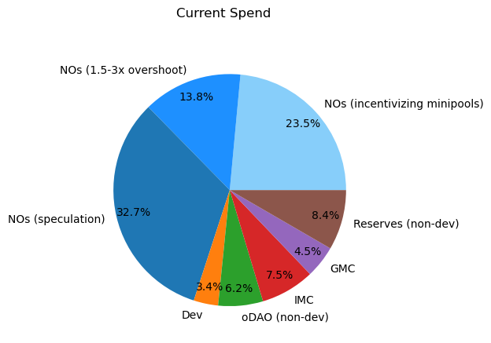
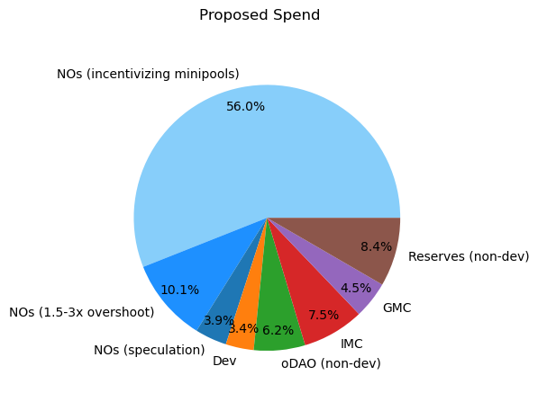

## Motivation
RPL inflation can be seen as protocol revenue that we steer to various places to achieve protocol
goals. This proposal looks to better align spending with protocol goals, specifically with the
portion of inflation (70%) that goes to Node Operators today.

**The primary goal of the proposal is to increase spend aligned with rETH supply creation.** This
means both rewarding based on minipool count and rewarding LEB8s over LEB16s (as they create more
rETH supply). Mechanically speaking, this means rewarding the minimum and near-minimum staked RPL
more, and basing rewards on borrowed ETH.

Secondarily, the proposal also aims to improve quality of life by avoiding locking people in far
from their desired asset allocation (which may lead to churn as folks exit to rebalance), retain
enough friction to avoid adding market volatility, and phase the new rules in slowly to minimize
market impacts.

## Rationale
**Please** see the proposal document on
[Valdorff's github](https://github.com/Valdorff/rp-thoughts/tree/main/rpl_staking), or its backup
printout [here](../assets/rpip-30/rpl_staking_readme.pdf). It greatly expands on the context, 
reasoning, and impacts for this proposal.

As a very high level summary, the below pie charts show overall intended spend before and after this
proposal. Mechanically, the blue categories are RPL staked from 10-15% of borrowed ETH value
(incentivizing), RPL staked from 15-30% of borrowed ETH value (overshoot), and RPL staked above 30%
of borrowed ETH value (speculation).

|  |  |
|:---------------------------------------------------------:|:-------------------------------------:|

The proposal focuses a lot more spend on incentivizing minipool creation, while still spending a
significant amount on the speculative and hands-off categories of RPL staking (compare with Dev
spend, for example). The current outsized speculation category (larger than Dev, oDAO, IMC, GMC,
and Reserves combined) has been significantly reduced so that we can spend a lot more on achieving
the protocol goal of attracting minipool creation (and rETH supplying).

## Specification

### Definitions
- `proposed_method_share` SHALL be defined as:
  - For one node, its `node_weight` divided by the sum of all `node_weight` across nodes
  - If staked RPL value in ETH is <10% borrowed ETH, then:
  ```math
  $$
    node\_weight=0
  $$
  ```
  - If staked RPL value in ETH is (>= 10% borrowed ETH) and (<=15% borrowed ETH), then:
  ```math
  $$
    node\_weight=100 * staked\_rpl\_value\_in\_eth
  $$
  ```
  - If staked RPL value in ETH is > 15% borrowed ETH, then:
  ```math
  $$
  node\_weight = (13.6137 + 2 * ln(100*\frac{staked\_rpl\_value\_in\_eth}{borrowed\_eth} - 13)) * borrowed\_eth
  $$
  ```
    - This value MAY be approximated if necessary
- `current_method_share` SHALL be defined as the share of rewards an NO receives using the latest
  active rewards tree spec when the vote is passed
- "Staked" RPL SHALL be defined as RPL that is locked within the protocol and counted by the
  protocol for all usage (vote weight, minipool creation, RPL rewards, etc)
- "Unstaking" RPL SHALL be defined as RPL that is locked within the protocol but _not_ counted by
  the protocol for usage
- "Unstaked" RPL SHALL be defined as RPL that is not within the protocol or is within the protocol
  but able to be withdrawn (RPL rewards from past periods, RPL that entered "Unstaking" a long
  enough time ago)
- X=1 is the first reward snapshot after (a) the end of the vote and (b) the
implementation of the new rewards rules. X=2 is the snapshot after that, etc.

### Final states
- For periods X>5, a node's share of reward SHALL be `proposed_method_share`
- The next significant smart contract upgrades (editor's note 2024-05-15 - this should be the upgrade following Houston) SHALL update the RPL withdrawal process to be a
  2-step process
  - A user MAY set any amount of "Staked" RPL beyond the value of 15% of the node's borrowed ETH to
    "Unstaking"
  - Once RPL has been "Unstaking" for `unstaking_period` days, it can be withdrawn
    - All RPL that was "Unstaking" MUST be withdrawn at one time
    - `unstaking_period` SHOULD be a pDAO-controlled setting initialized to 28 days
  - There SHALL only be a single time stored for "Unstaking" RPL; this means that if a user sets
    additional RPL to "Unstaking" after some RPL is already "Unstaking", they must wait for
    `unstaking_period` before any is available to withdraw
    - All RPL that was already "Unstaking" for `unstaking_period` SHOULD be withdrawn when a user
      sets additional RPL to "Unstaking"
  - The withdrawal cooldown after last RPL stake (currently one reward period, prior to this RPIP)
    SHALL be changed to use a pDAO-controlled setting initialized to 0 days 
- Voting power calculations SHALL NOT be changed based on this RPIP (though do note that they SHALL
  NOT count "Unstaking" RPL)

### Transitioning towards final states
- For periods X=1 to X=5: a node's share of rewards is
```math
$$
\frac{X}{6}*proposed\_method\_share + \frac{6-X}{6}*current\_method\_share
$$
```
  - For these periods, the rewards tree spec MUST specify how to calculate `current_method_share`,
    `proposed_method_share`, and how to combine them to get a node's share of rewards
- If the 2-step withdrawal process described above has not yet been implemented, partial steps SHALL
  be taken to reduce withdrawal limits
  - Within two weeks after X=3 rewards go out, set withdrawal limit to 100% of a node's bonded ETH
  - Within two weeks after X=6 rewards go out, set withdrawal limit to 60% of a node's bonded ETH

## Implementation thoughts
- For the withdrawal limit in transition, `node.per.minipool.stake.maximum` can be modified to
  achieve the desired limit. Note that this may require a change to the reward tree spec, for
  example `current_method_share` could use a constant rather than accessing this variable.

## Additional Context

### Showing node weight's subcomponents in the sublinear region
Some folks expressed a preference for seeing a few constituent terms that create the node_weight
formula to better understand it, so we're including that here:

```math
$$
node\_weight = diminishing\_reward\_term + weight\_at\_15pETH + offset\_to\_align\_functions
$$
```
```math
$$
diminishing\_reward\_term = 2*borrowed\_eth*\ln\left(100*\frac{staked\_rpl\_value\_in\_eth}{borrowed\_eth} - 13\right)
$$
```
```math
$$
weight\_at\_15pETH = 100*0.15*borrowed\_eth
$$
```
```math
$$
offset\_to\_align\_functions = 1.3863*borrowed\_eth
$$
```

Essentially, rewards scale with the node's `borrowed_eth` with diminishing effectiveness based on
higher collateralization (in terms of RPL value per borrowed ETH). Additional math is there to
create a smooth transition from the preceding linear region in terms of both total rewards and
marginal APR (the amount of rewards you get for the next unit of RPL).

### RPL yield sensitivity
A significant concern from some community members was that it may cause some folks to downgrade
their expectations of RPL and decide to sell. The author does not share this view and believes that
aligning spending with protocol goals improves what we should expect from both the protocol and the
token.

An analysis of possible fallout can be found in the `Which NOs are sensitive to RPL yield?` section
of the research document on
[Valdorff's github](https://github.com/Valdorff/rp-thoughts/blob/main/rpl_staking/research.md), or
its backup printout [here](../assets/rpip-30/rpl_staking_research.pdf). The key conclusion is
that only up to ~4k ETH worth of RPL is sensitive to yield and in a range where they could improve
their yield by selling. Note that this does _not_ include the effect of RPL buying that is attracted
from (a) holders sensitive to yield in a range where they could improve their yield by buying or (b)
new joiners that are attracted by the greater incentives due to the now-higher spend on rETH supply.

### Withdrawal friction

The premise of the 2-step withdrawal system is to reduce volatility, both in general (where there’s
no temptation to trade a quick spike), and especially in the case of a bank run (where people try to
exit to sell before others exit to sell). The thought was very much inspired by Cosmos unbonding
times. The position also partly came about as a compromise between folks that would like to see no
lockup beyond the minimum and folks that would like higher lockups (eg, 100% bonded ETH); adding
friction to exiting presented a midpoint between being fully liquid and being fully locked.

While the `unstaking_period` is set to a rewards period or longer, it also helps avoid gaming
staking rewards (eg, have RPL earning yield in Defi, then move it over in time for the rewards
snapshot). In order to keep a realistic option of lowering `unstaking_period` beyond that, the
"withdrawal cooldown after last RPL stake" feature is set to zero, but not entirely removed -- while
there's no current plan to do so, this method keeps open the path of lowering `unstaking_period`
(alongside an increase in withdrawal cooldown to resist gaming). 

## Acknowledgements
I'd like to explicitly acknowledge the many folks that participated in research discussion on this
idea. Please let me know if I missed you when scrolling through. In alphabetical order:

0xL2, 0xSheen, 5dayoldburrito, anisoptera.eth, astoneta.eth, bernard, bjobjo, Blackclaws, butta.eth,
Calurduran, Cayos, chessman, chris_marino, cowzow, d33t00, DagoDuck, David VI, Doublemint,
Dr Doofus, Epineph, Erowind, ewan.eth, feyo.eth, firegogo, Freek, FUINY7, fullwall, hackworth.eth,
halzen.eth, harpocryptes, Hollywood_Squares, ib1gymnast, Intelligent Investoor, invis, ivelin.eth,
james, Ken, knoshua, L3O, lilac, Ludi, luominx, lutro, mattkunke.eth, Ments, MetalSeed, mfilipe,
Mig, mikeylikesit, Myguy, NeverAnIsland, NickS, noahscape, NonFungibleYokem, notyou, occam,
philcares.eth, Pieter, pk3268, quant, ramana, rocket__1, RocketDoc.eth, rocknet, Rudes.eth,
sadcuzz.eth, Saint Rat, SANTINO33, sckuzzle, señor, slipstream, sneaky.eth, SNG, Snocones, socash,
sonax, StableScarab, takezo, Team Berebere, teamRick, techcapo, uisce, Wander, Waq, woodenship.eth,
wowsuchname.eth, Xero.eth, yeehaw0x, Yorick, ZQQLANDER

Some folks here chatted up a storm, reviewed models, and contributed their own models/essays. Some
folks came out of lurking just long enough to provide their perspective. Many were in between. All
are appreciated. It's stunning that we had over 90 people participate in an early research thread.

<3 RP community.

## Copyright

Copyright and related rights waived via [CC0](https://creativecommons.org/publicdomain/zero/1.0/).
