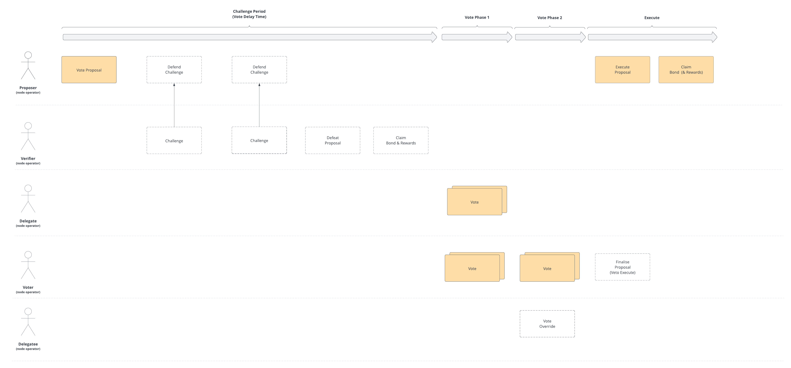

## Abstract

This RPIP specifies an on-chain replacement for the pDAO governance system's execution process. It uses an optimistic
fraud-proof system that allows any node operator to raise proposals and vote on proposals to adjust "pDAO protocol
parameters" and spend treasury funds.

## Motivation

The pDAO has two primary powers within Rocket Pool. The first is having control over certain parameters which define how
the protocol operates. e.g. Enabling or disabling deposits or setting the rate of inflation. The second role is spending
treasury funds; A portion of RPL inflation is sent to a contract which the pDAO has the power to spend.

Currently, the core team is responsible for executing pDAO duties at the behest of the community governance process. For
example, the team carries out the monthly IMC and GMC payments as per the governance voted payment schedules. The plan
was for this power to reside with the team temporarily until a new power structure is set up to take over these
responsibilities.

The motivation for this proposal is to remove the dependency on the team, making the protocol more decentralised and
trustless.

## Specification

### Voting Power Function

When a node registers with Rocket Pool, they are appended to the `nodes` set. Their index into that set uniquely
identifies that node. This section refers to a node by its index into the global set.

The voting power function for members of the pDAO SHALL be formally defined as:

```math
$$
P_{n} = \sum_{i=1}^{N} \begin{cases}
p_{i} & d_{i} = n \\
0 & else \\
\end{cases}
$$
```

```math
$$
p_{n} = {\sqrt{R_{n}}}
$$
```

```math
$$
R_{n} = min(S_{n}, M_{n})
$$
```

```math
$$
M_{n} = \frac{N_{n} \times 1.5}{r}
$$
```

Where:

* $P_{n}$ is the voting power for $n$.
* $S_{n}$ is RPL staked on the node $n$.
* $R_{n}$ is the maximum vote weight
* $M_{n}$ is the maximum RPL staked that is counted towards voting
* $N_{n}$ is the amount of bonded ETH on a node (the amount a node operator $n$ has contributed).
* $d_{n}$ is the node which $n$ has delegated to.
* $r$ is the current market rate of RPL in ETH.
* $N$ is the number of nodes in the node set.

Total voting power can be expressed as the following:

```math
$$
P = \sum_{i=1}^{N} P_{i}
$$
```

### Proposal Types

Proposals MUST be one of the following types:

* Parameter Change
* Treasury Spend
* Treasury Contract Change
* Security Council Change

#### Parameter Change

A parameter change proposal SHALL comprise one or more setting paths and their new values. Upon successful execution,
the
protocol setting(s) SHALL be updated to the supplied value(s).

The protocol settings which SHALL be configurable by this proposal type are listed in
the [Parameter Table](#parameter-table).

Future protocol upgrades MAY introduce new settings to this set which SHALL be set to a reasonable default value that
can then be updated by the pDAO via a proposal. Future upgrade proposals SHALL include a list of new parameters, their
default values and whether or not they are modifiable by the Security Council.

When parameters are added or removed, the [Parameter Table](#parameter-table) in this RPIP SHOULD be updated to reflect
them.

#### Treasury Spend

This proposal type deals with one-time spends of RPL from the protocol's treasury.

A proposal of this type comprises the following:

1. **Invoice ID:** An arbitrary string associated with the payment used for bookkeeping purposes.
2. **Recipient Address:** The Ethereum address of the beneficiary of this payment.
3. **Amount:** An amount in RPL to send to the beneficiary.

Upon execution of a successful proposal of this type, the protocol SHALL send the provided amount of RPL from its
treasury to the recipient.

#### Treasury Contract Change

This proposal type deals with the creation and modification of "payment contracts" which are recurring payments made to
a specified beneficiary each reward period.

A payment contract comprises:

1. **Contract Name:** An arbitrary string associated with this contract used for bookkeeping purposes.
2. **Recipient Address:** The Ethereum address of the beneficiary of this payment.
3. **Amount Per Interval:** The amount of RPL to send per reward interval. Specified as a percentage of RPL rewards the
   pDAO received in a given interval.
4. **Start Date:** A unix timestamp specifying when payments should begin.
5. **Number of Periods:** The number of periods the protocol will pay the beneficiary.

A proposal of this type can perform one of these actions:

1. **Create:** Creates a new contract.
2. **Cancel:** Prematurely cancels a contract.
3. **Replace:** Cancels an existing contract and creates a new one in a single transaction.

Recipients of recurring payments from the treasury MAY claim their payments at any time. Recurring payments occur
without a transaction. Therefore, recipient MUST execute a transaction in order to receive their RPL from the treasury.

Recipients of payments MAY execute a claim at any time from the recipient address specified in the payment
contract. The protocol SHALL calculate all payments up to that point in time and transfer the required RPL from its
treasury to the recipient.

#### Security Council Change

The purpose of the proposal type is to control the set of members of the "Security Council". The following actions are
possible:

1. **Invite Member:** Invites a new member to the Security Council.
2. **Remove Members:** Removes existing members from the Security Council.

Note that the security council MAY be effectively disabled by removing all members.

The pDAO also has control over how many members are required for quorum. This is adjusted with a parameter change of the
parameter `security.members.quorum`.

Invited members must accept the invitation to join before they are counted as part of the security council.

### Security Council

The pDAO SHALL have control over a selection of members which form a "Security Council". This council SHALL have the
power to make changes to certain parameters without requiring a delay. The parameters which are modifiable are
highlighted in the [Parameter Table](#parameter-table) with a *.

Security Council members MAY raise a proposal to make a parameter change at any time. If `security.members.quorum`
percent of members vote in favour of the proposal, it is immediately effected.

Security Council members MAY leave the council on their own accord. This is a two-step process. They MUST first send
a transaction indicating their desire to leave. They MUST then wait a time specified by a pDAO controllable parameter.
They MUST then send a second transaction to action the request. The second transaction must be sent after the notice
period and before the request expires. Both these periods are pDAO controllable parameters.

Security Council membership is a serious role and the pDAO SHOULD develop strong entry requirements and processes for
routinely flushing stale members. The development of these requirements and processes is left for a future RPIP. To
begin with, the current pDAO guardian SHALL be the sole member.

### Proposal Voting Process



#### Snapshotting

In order to calculate voting power $P_{n}$ at any given block, the protocol SHALL maintain an on-chain array of changes
to all input variables to the voting power function. The value at a past block can then be looked up via a
recency-biased binary search.

The following values SHALL be snapshot each time they are changed on chain:

* RPL staked on a node ($S_{x}$)
* Bonded ETH ($N_{x}$)
* Delegate of a node operator ($d_{x}$)
* Price of RPL against ETH ($r$)
* The number of registered nodes ($N$)

#### Proposing

Any node with a non-zero voting power MAY raise a proposal at any time. RPL equal to the proposal bond SHALL be locked 
for the duration of the proposal process. In order to be eligible to propose, node MUST have an RPL stake 
(minus any already locked RPL) greater than the proposal bond. Locked RPL SHALL act the same way as regular staked RPL 
for the purposes of rewards, voting and collateral requirements. Locked RPL SHALL NOT be counted towards thresholds for
withdrawing RPL.

By default, locking RPL for any purpose defined in this RPIP, will be disabled. Node operator's will opt-in to performing governance activities by enabling the locking of RPL from their node or primary withdrawal address. On the condition that [RPIP-31: RPL Withdrawal Address](./RPIP-31.md) is ratified and implemented, if the RPL withdrawal address is set then, you will only be able to enable or disable RPL locking using this address.

As part of a proposal submission, a node operator MUST provide a Merkle pollard across a Merkle-sum tree of delegated
voting power at a block that is at most `proposal.max.block.age` blocks old. From this pollard the protocol SHALL
calculate the total protocol voting power $P$. The root of this pollard alongside the sum SHALL be stored by the
protocol against the proposal.

If a proposal is challenged, the proposer MAY respond to the challenge by providing a new pollard where the root node
is the challenged index and a Merkle proof from the challenged index back to the proposal root. A proposer will be
unable to respond if the response requires submitting a pollard containing leaf nodes where the leaf nodes do not match
the actual values on chain. In this way, they are forced to not respond for `proposal.challenge.period` time. After
which, the proposal can be defeated.

If a proposal is defeated, the proposer forfeits their bond which is divided proportionally amongst the challengers who
contributed to the proposal's defeat.

#### Challenging 

Any node MAY challenge a proposal by supplying an index into the Merkle-sum tree that they are alleging is incorrect.
The challenger MUST have at least `proposal.challenge.bond` unlocked RPL stake. And this amount of the
challenger's RPL SHALL BE locked until the proposal is defeated, or until the bond is lost.

The index which is alleged to be incorrect MUST be an index of a node in one of the pollards that the proposer has
submitted. Either the initial pollard submitted with the proposal, or any subsequent response pollards to a challenge.

If the initial pollard submitted by the proposer is invalid, they will be unable to respond to challenges which require
the proposer to provide information that is known on chain. It will take a few rounds of challenges and responses to
reach the last layer of the Merkle-sum tree. After which, the proposer will no longer be able to respond to challenges.

After `proposal.challenge.period` has passed and the proposer has not responded to the challenge, any one MAY
defeat the proposal. If a proposal is defeated, it SHALL NOT enter the voting period. And SHALL NOT be executed.

After defeating a proposal, each challenger who participated in defeating the challenge SHALL be paid a proportional
amount of the proposer's bond. Each challenger who submitted a challenge, whether it contributed to the defeat or not
SHALL be able to claim their challenge bond.

Contributing to the defeat of a proposal means a challenger submitted an index which was later proven to be incorrect by
the proposers inability to reply to a challenge. It is possible that there are multiple incorrect indices but only those
that resulted in the defeat of the proposal share the reward. All other challengers receive their bond back only.

If a challenger challenges a node, the proposer responds, and the proposal does not get defeated. The proposer SHALL be
able to claim the challenge bonds from the invalid challenges.

#### Voting

If a proposal is not defeated after `proposal.vote.delay.time` has passed, the proposal enters the voting stages.

During the voting stages, delegates and node operators MAY vote on the proposal. Each node operator who has a non-zero voting power MAY vote with one of the following options:

1. **Abstain:** The voter's voting power is contributed to quorum but is neither for nor against the proposal.
2. **For:** The voter votes in favour of the proposal being executed.
3. **Against:** The voter votes against the proposal being executed.
4. **Veto:** The voter votes against the proposal as well as indicating they deem the proposal as spam or malicious. If
   the veto quorum (as defined by the `proposal.veto.quorum parameter`) is met, the proposal is immediately defeated and
   the proposer loses their bond. This is to dissuade spam, low quality proposals, or proposals that have not gone
   through off-chain processes first.

In the first voting stage, voting delegates, and node operators who have not delegated (effectively delegated to themselves), cast their vote by providing a Merkle proof of their voting power (relative to the submitted proposal root). Once the first stage has passed, voting enters the second voting stage. Node operators who have delegated their vote, get the opportunity to override their delegate's vote, if they disagree.

The quorum required for the proposal to pass is set to `proposal.quorum` percent of $P$. Once the voting stages have passed, a proposal is successful if **For** votes are greater than **Against**.

#### Veto

Voters may deem a proposal to be spam or particularly dangerous. They have the option to cast a **Veto** vote. The veto quorum is set to `proposal.veto.quorum` percent of $P$. If a proposal is vetoed, the proposer's bond is burned by sending it to the common Ethereum burn address [0x0000000000000000000000000000000000000000](https://etherscan.io/address/0x0000000000000000000000000000000000000000).

#### Execution

Once both voting periods have passed and the proposal is successful, the proposal can be executed and the change (defined by the payload) is applied to the Rocket Pool protocol. 

After the proposal has passed the voting periods, the proposer MAY unlock their RPL bond, unless the proposal was defeated by a challenge or vetoed.

### Further Technical Information

More in depth technical information about the Merkle-sum tree and pollard generation can be
found [here](https://github.com/rocket-pool/rocketpool-research/blob/houston/Protocol%20DAO/pdao-prop-challenge-spec.md).

## Rationale

The purpose of the Merkle sum tree is to overcome a limitation in the EVM of being able to iterate over each node in the
node set and accumulate the sum of all voting power at a given block. This would require iterating over thousands of
storage slots which would quickly exceed the gas limit of a single Ethereum block.

In order to decide the outcome of a proposal, the protocol must know the quorum required. And because the quorum is a
function of the total voting power, the total voting power must be known at the proposal block.

We overcome this limitation by requiring a proposer to calculate this value and submit it alongside their proposal. We
optimistically accept this value but in the case of fraud, verifiers can perform a challenge/response process to prove
the value is incorrect. Invalid proposals are then discarded.

There are many benefits to this approach but the primary drawback is the increase in gas and complexity. That gas
increase comes at a minor cost to node operators and the complexity excludes us from using existing governance software.

The dev team feels strongly that this trade off is worth it, given the alternative is to adopt a simpler voting power
model which we feel is not the right direction for the protocol. Rocket Pool’s unique governance system is distinct from
other DAOs, making governance capture significantly more difficult and giving power to those most aligned with the
protocol’s long-term health in mind.

## Backwards Compatibility

There are no backwards compatibility concerns with this proposal.

## Reference Implementation

A WIP implementation of this specification which includes a full test suite is
provided [here](https://github.com/rocket-pool/rocketpool/tree/onchain-pdao).

## Security Considerations

The design is relatively complex and any design or implementation bugs can have significant impact. In worse case, a
flaw in the fraud-proof system could result in the theft of the entire pDAO treasury. Malicious parameter changes are
also a possibility but the impact is minor in comparison as the parameters the pDAO controls are mostly disabling
features which can be easily undone.

The final implementation should undergo extensive auditing and testing as is standard with all protocol upgrades.

Presently, the team has control over the pDAO "guardian". This allows the team to immediately disable features of the
protocol that may protect against loss of funds in the case of a protocol bug or exploit. This proposal removes this
safety net. As a compromise, this proposal introduces a "Security Council" which has limited power to make immediate
changes to the protocol. This Security Council needs to be maintained to always comprise active members who can react to
potential threats.

## Parameter Table

Below is a comprehensive list of protocol parameters the pDAO SHALL have control over and specifies guardrails in place
to prevent altering parameters which may result in inoperability of the protocol

| Setting Contract                   | Setting Path                              | Type    | Description                                                                                                                                                                                             | Guardrail                                                            |
|------------------------------------|-------------------------------------------|---------|---------------------------------------------------------------------------------------------------------------------------------------------------------------------------------------------------------|----------------------------------------------------------------------|
| rocketDAOProtocolSettingsDeposit   | deposit.enabled*                          | bool    | Enables/disables ETH deposits for rETH                                                                                                                                                                  |                                                                      |
|                                    | deposit.assign.enabled*                   | bool    | Enables/disables the assignment of ETH to the minipool queue                                                                                                                                            |                                                                      |
|                                    | deposit.minimum                           | uint256 | The minimum ETH amount that can be deposited                                                                                                                                                            |                                                                      |
|                                    | deposit.pool.maximum                      | uint256 | The maximum amount of ETH that can be present in the deposit pool before no more deposits are accepted                                                                                                  |                                                                      |
|                                    | deposit.assign.maximum                    | uint256 | The absolute maximum number of minipools that can be assigned ETH during a single deposit                                                                                                               |                                                                      |
|                                    | deposit.assign.socialised.maximum         | uint256 | The number of minipools that will be assigned ETH during a deposit regardless of the deposit size                                                                                                       |                                                                      |
|                                    | deposit.fee                               | uint256 | The rETH deposit fee applied to deposits                                                                                                                                                                | < 1%                                                                 |
|                                    |                                           |         |                                                                                                                                                                                                         |                                                                      |
| rocketDAOProtocolSettingsInflation | rpl.inflation.interval.rate               | uint256 | 5% annual calculated on a daily interval - Calculate in js example: let dailyInflation = web3.utils.toBN((1 + 0.05) ** (1 / (365)) * 1e18);                                                             | No greater than 1e16 more than the previous value. Should not be < 1 |
|                                    | rpl.inflation.interval.start              | uint256 | Set the default start date for inflation to begin as 1 day after deployment                                                                                                                             | > now                                                                |
|                                    |                                           |         |                                                                                                                                                                                                         |                                                                      |
| rocketDAOProtocolSettingsMinipool  | minipool.submit.withdrawable.enabled*     | bool    | Not relevant since we redesigned withdrawals to exclude the oDAO                                                                                                                                        |                                                                      |
|                                    | minipool.bond.reduction.enabled*          | bool    | Enables/disabled minipool bond reductions                                                                                                                                                               |                                                                      |
|                                    | minipool.launch.timeout                   | uint256 | The time before a minipool will be scrubbed                                                                                                                                                             | >= 12 hours                                                          |
|                                    | minipool.maximum.count                    | uint256 | The maximum number of minipools the protocol will allow                                                                                                                                                 |                                                                      |
|                                    | minipool.user.distribute.window.start     | uint256 | The time a user must wait before being able to distribute a minipool                                                                                                                                    | Fix to 90 days                                                       |
|                                    | minipool.user.distribute.window.length    | uint256 | The time a user has to distribute a minipool after waiting the start length                                                                                                                             |                                                                      |
|                                    |                                           |         |                                                                                                                                                                                                         |                                                                      |
| rocketDAOProtocolSettingsNetwork   | network.consensus.threshold               | uint256 | The number of oDAO members that have to submit for a price/balances update to take affect express as a percentage                                                                                       | >= 51%                                                               |
|                                    | network.submit.balances.enabled*          | bool    | Enables/disables balances submissions                                                                                                                                                                   |                                                                      |
|                                    | balance range                             | uint256 | How much the balance can increase by each interval                                                                                                                                                      |                                                                      |
|                                    | network.submit.balances.frequency         | uint256 | How long between network balance submissions                                                                                                                                                            | >= 1 hour                                                            |
|                                    | network.submit.prices.enabled             | bool    | Enables/disables prices submissions                                                                                                                                                                     |                                                                      |
|                                    | network.submit.prices.frequency           | uint256 | How long between price submissions                                                                                                                                                                      |                                                                      |
|                                    | network.node.fee.minimum                  | uint256 | The node fee minimum                                                                                                                                                                                    | >=5% & <= 20%                                                        |
|                                    | network.node.fee.target                   | uint256 | The node fee target                                                                                                                                                                                     | >=5% & <= 20%                                                        |
|                                    | network.node.fee.maximum                  | uint256 | The node fee maximum                                                                                                                                                                                    | >=5% & <= 20%                                                        |
|                                    | network.node.fee.demand.range             | uint256 | The node fee demand range                                                                                                                                                                               |                                                                      |
|                                    | network.reth.collateral.target            | uint256 | The target amount of ETH that is held by the protocol to satisfy rETH burns                                                                                                                             |                                                                      |
|                                    | network.penalty.threshold                 | uint256 | The number of oDAO members that have to vote for a penalty expressed as a percentage                                                                                                                    |                                                                      |
|                                    | network.penalty.per.rate                  | uint256 | The amount a node operator is penalised for each penalty as a percentage                                                                                                                                |                                                                      |
|                                    | network.submit.rewards.enabled*           | bool    | Enables/disable reward tress submission                                                                                                                                                                 |                                                                      |
|                                    |                                           |         |                                                                                                                                                                                                         |                                                                      |
| rocketDAOProtocolSettingsNode      | node.registration.enabled*                | bool    | Enables/disables node registration                                                                                                                                                                      |                                                                      |
|                                    | node.smoothing.pool.registration.enabled* | bool    | Enables/disables smoothing pool registration                                                                                                                                                            |                                                                      |
|                                    | node.deposit.enabled*                     | bool    | Enables/disables creation of new minipools via a node deposit                                                                                                                                           |                                                                      |
|                                    | node.vacant.minipools.enabled*            | bool    | Enables/disables the create of vacant minipools for solo staker migration                                                                                                                               |                                                                      |
|                                    | node.per.minipool.stake.minimum           | uint256 | The minimum amount of RPL that must be staked by a node operator to receive rewards                                                                                                                     |                                                                      |
|                                    | node.per.minipool.stake.maximum           | uint256 | The maximum amount of RPL that can be staked by a node operator to receive rewards                                                                                                                      |                                                                      |
|                                    |                                           |         |                                                                                                                                                                                                         |                                                                      |
| rocketDAOProtocolSettingsRewards   | rpl.rewards.claim.period.time             | uint256 | The period of time between reward tree submissions                                                                                                                                                      | >= 1 day                                                             |
|                                    |                                           |         |                                                                                                                                                                                                         |                                                                      |
| rocketDAOProtocolSettingsProposals | proposal.vote.phase1.time                 | uint256 | How long voting phase 1 of a proposal lasts and the proposal can enter phase 2                                                                                                                          | >= 1 day                                                             |
|                                    | proposal.vote.phase2.time                 | uint256 | How long voting phase 2 of a proposal lasts and the result can be determined                                                                                                                            | >= 1 day                                                             |
|                                    | proposal.vote.delay.time                  | uint256 | How long before a proposal can be voted on after its created                                                                                                                                            | >= 1 week                                                            |
|                                    | proposal.execute.time                     | uint256 | How long after a successful proposal can it be executed before it expires                                                                                                                               | >= 1 week                                                            |
|                                    | proposal.bond                             | uint256 | How much RPL is locked when creating a proposal                                                                                                                                                         | > 20 RPL                                                             |
|                                    | proposal.challenge.bond                   | uint256 | How much RPL is locked when challenging a proposal                                                                                                                                                      | > 2 RPL                                                              |
|                                    | proposal.challenge.period                 | uint256 | How long a proposer has to respond to a challenge before the proposal is defeated                                                                                                                       | >= 30 minutes                                                        |
|                                    | proposal.quorum                           | uint256 | The minimum amount of voting power a proposal needs to succeed                                                                                                                                          | >= 51% & < 75%                                                       |
|                                    | proposal.veto.quorum                      | uint256 | The amount of voting power vetoing a proposal require to veto it                                                                                                                                        | >= 51% & < 75%                                                       |
|                                    | proposal.max.block.age                    | uint256 | The maximum time in the past (in blocks) a proposal can be submitted for                                                                                                                                | > 128 blocks & < 7200 blocks                                         |
|                                    |                                           |         |                                                                                                                                                                                                         |                                                                      |
| rocketDAOProtocolSettingsSecurity  | security.members.quorum                   | uint256 | Member quorum threshold that must be met for proposals to pass (51%)                                                                                                                                    | >= 51% & <= 75%                                                      |
|                                    | security.members.leave.time               | uint256 | How long a member must give notice for before manually leaving the security council                                                                                                                     | < 14 days                                                            |
|                                    | security.proposal.vote.time               | uint256 | How long a proposal can be voted on                                                                                                                                                                     | >= 1 day                                                             |
|                                    | security.proposal.execute.time            | uint256 | How long a proposal can be executed after its voting period is finished. (i.e. a proposal expires and can no longer be executed after `security.proposal.vote.time` + `security.proposal.execute.time`) | >= 1 day                                                             |
|                                    | security.proposal.action.time             | uint256 | Certain proposals require a secondary action to be run after the proposal is successful (joining, leaving etc). This is how long until that action expires                                              | >= 1 day                                                             |
|                                    |                                           |         |                                                                                                                                                                                                         |                                                                      |
| rocketDAOProtocolSettingsAuction   | auction.lot.create.enabled*               | bool    | Enables or disables the ability to create auction lots                                                                                                                                                  |                                                                      |
|                                    | auction.lot.bidding.enabled*              | bool    | Enables or disables the ability for users to bid on auction lots                                                                                                                                        |                                                                      |
|                                    | auction.lot.value.minimum                 | uint256 | The minimum amount of RPL required to create an auction lot                                                                                                                                             | >= 1 RPL                                                             |
|                                    | auction.lot.value.maximum                 | uint256 | The maximum amount of RPL per auction lot                                                                                                                                                               | >= 1 RPL                                                             |
|                                    | auction.lot.duration                      | uint256 | The duration of auctions (in seconds)                                                                                                                                                                   | >= 1 day                                                             |
|                                    | auction.price.start                       | uint256 | The starting price of auctions (as a percentage encoded as a fraction of 1e18)                                                                                                                          | >= 10%                                                               |
|                                    | auction.price.reserve                     | uint256 | The lowest the price will go in an auction (as a percentage encoded as a fraction of 1e18)                                                                                                              | >= 10%                                                               |

A * designates this parameter as being modifiable by the Security Council without a delay.

## Copyright

Copyright and related rights waived via [CC0](https://creativecommons.org/publicdomain/zero/1.0/).
