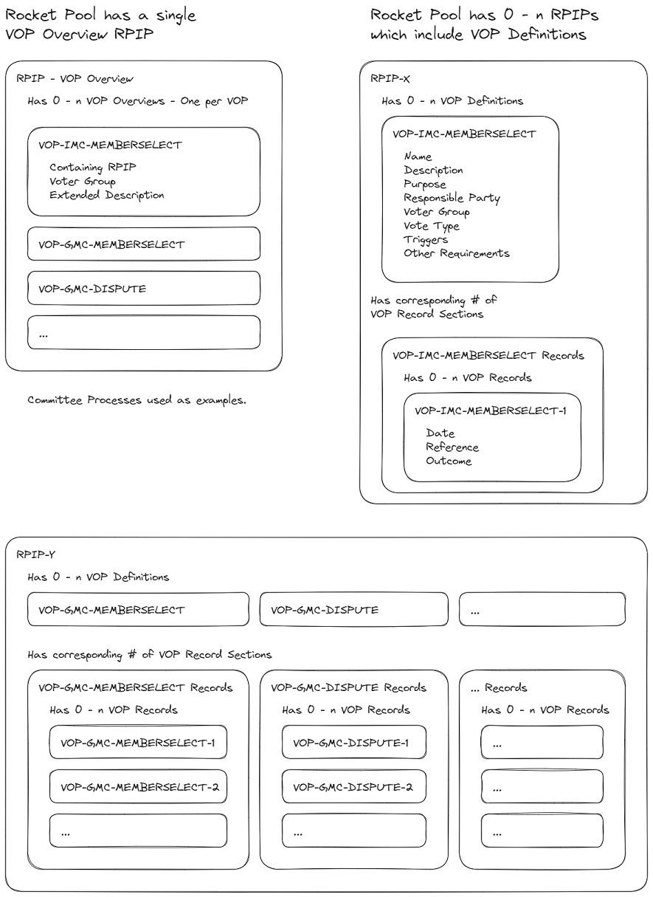

## Abstract

The Voted Operational Process (VOP) Framework consists of VOP definitions, VOP records, VOP instances, and the VOP overview. VOP definitions are included in RPIPs and define how a specific operational process takes place. VOP records are also included in RPIPs and contain relevant information connected to the outcome of instances of a defined process. A VOP instance is a single example of a process taking place according to a VOP definition. The VOP overview is a living informational RPIP that summarizes existing VOP definitions for accessibility and transparency. This RPIP also mandates the conversion of appropriate existing processes within the Rocket Pool DAOs to fall under the VOP framework. 

## Motivation

The creation of an operational process framework will lead to reduced participation costs, increased transparency, and increased extensibility for DAO operational decision-making.

**Reduced Cost**

First, the types of processes that exist can be listed, summarized, and presented in such a way that is more approachable to the average participant than reading through multiple full RPIPs. Participant attention is a scarce and valuable resource. If all that is needed is a high-level overview of 'how does process x work in Rocket Pool', then attention should not need to be spent digging through low-level details unless required.

Second, votes and discussions can be labeled explicitly according to the process they are using. This makes it easier for participants to quickly slot items into the appropriate mental boxes. Essentially, it becomes easier for voters and participants to tailor their level of engagement to the seriousness of the decision at hand. For example:
* RPIPs are now more important because they always represent a change to the status quo rather than an operational decision. "I should pay attention!"
* A GMC election doesn't represent a change to how Rocket Pool works, but it's important to set the general direction of grant spending via membership. "I might provide some input!"
* A grants appeal can be more safely left to those with more time/interest in low-level grant decisions. "Other parts of my life take priority right now!"

Thirdly, this also levels the playing field for participants with different levels of commitment. There is a reduced need to understand many subtly different processes. Instead, there is a general framework that makes engagement with any process less of a mental hurdle once the framework is understood.

**Transparency**

The outcomes of processes can be recorded in a clear, consistent, and accessible manner. This is worthwhile in and of itself, but it also reduces the attention and mental effort required to find relevant information.

**Extensibility**

Adoption of an operational process framework helps to structure the processes of the Rocket Pool DAOs in such a way that they are easily extensible in future improvement proposals. The motivation here is to encourage organization, transparency, and accessibility in such a way that it becomes self-sustaining. If there is a clear existing structure in use, then it encourages its use in future RPIPs.

## Specification

### VOPs: What and When?
This section describes what a VOP is, and when to use the VOP framework.

* A Voted Operational Process (VOP) is a process involving a vote through which an operational decision is made.
  * Some operational decisions within the Rocket Pool DAOs MAY NOT require a vote, and should not be included under the VOP framework.
* A VOP MUST NOT be defined to cover decisions that are improvements to the Rocket Pool protocol, Rocket Pool DAOs, or anything that should otherwise require the use of the RPIP process.
* The dividing line between which decisions should use the RPIP process versus the VOP framework may be unavoidably blurry. The following general recommendations are made:
  * If a proposal can reasonably predicted to be unique, it is RECOMMENDED to use the RPIP process.
  * If a proposal is the first of its type or class, and it is not anticipated to repeat frequently or regularly it is RECOMMENDED to use the RPIP process.
  * If a proposal is not unique or is expected to occur frequently, the VOP framework is RECOMMENDED.
* The VOP framework SHOULD be used for anything that fits the definition of a voted operational process. 
  * If an RPIP specifies a process that could reasonably fit within the VOP framework, without adhering to the VOP framework, it MUST include a detailed rationale as to why adhering to the VOP framework is not preferable.

---

### Visual Aid for VOP Concepts


 

---

### VOP Usage - Definitions
> The VOP-EMC-MEMBERSELECT definition describes how EMC (example management committee) elections take place.

* A VOP definition contains the elements that make up a particular type of VOP.
* A VOP definition MUST include the elements defined under the VOP Elements heading of this specification.
* A VOP definition SHOULD follow the template defined under the VOP Definition Template heading of this specification.
* If the use of the VOP framework is appropriate, a VOP definition MUST be included in the RPIP in which the process is described.


#### VOP Elements
* ID - A short, unique, human-readable string identifier that can be used to identify instances of this VOP. Should take the rough form of VOP-SUBJECT-ACTION
* Name - A plain English identifer (aim for a handful of words)
* Description - A description of this VOP.
* Purpose - Why does this VOP definition exist?
* Responsible Party - What party is responsible for ensuring this VOP takes place when it is triggered?
* Voting Group - Which group votes on the outcome of this VOP?
* Vote Type - What platform and format does this vote use?
* Triggers - See section below
* Other Requirements - See section below

##### VOP Triggers
* An event or situation that triggers this VOP to take place.
* VOPs MAY have multiple triggers. 
  * Multiple triggers have an OR relationship unless specified otherwise: Any met trigger can result in a new VOP instance.  
* Triggers SHALL be considered mandatory unless explicitly designated as optional.
  * 'At Will' is an exception to this, and is always to be considered optional. 
  * If a mandatory trigger condition is met, a responsible party SHOULD begin an instance of the VOP.

##### VOP Other Requirements
* A VOP MAY have more detailed requirements or prerequisites than can be easily summarized into the VOP definition format.
* Any requirements of this nature SHOULD be detailed under a specific heading in the same or another RPIP. 
  * This heading should then be referenced in the VOP definition under 'Other Requirements'.

---

### VOP Usage - Instances
> VOP-EMC-MEMBERSELECT-1 is a single EMC (example management committee) membership selection, with a date, candidates, a vote, and results.

* A VOP instance is an instantiation of a VOP definition.  
* When a VOP instance is triggered, it SHALL be assigned the next free instance number by the responsible party.
  * Instance numbers are unique per VOP definition, start at 1, and increment by 1. 
  * A VOP instance number MUST be appended to the VOP ID with a hyphen, forming a unique ID code for that process instance. 

---

### VOP Usage - Records
> The outcome of the VOP-EMC-MEMBERSELECT-1 instance is recorded in the appropriate record VOP record section.

* A VOP record entry contains the results of a concluded VOP instance.
* A VOP record section MUST be included in the RPIP in which a VOP is defined.
  * The VOP record section SHOULD follow the template defined under the VOP Record Section Template heading of this specification.
  
* When a VOP instance concludes, its outcome MUST be recorded in the appropriate VOP record section by the RPIP Editors. 
  * A VOP Record MUST include the date the VOP instance concluded.
  * A VOP Record MUST include an appropriate URL link indicating the outcome of the VOP.
  * A VOP Record MUST include a brief, human-readable summary of the outcome.

---

### VOP Usage - Overview
> A Living informational RPIP that lists and summarizes currently defined VOPs such as VOP-EMC-MEMBERSELECT.

* The VOP overview is a summary of defined VOPs within Rocket Pool.  
* The VOP overview SHOULD exist as a living, informational RPIP maintained by the RPIP Editors.
* Whenever an RPIP is ratified, the RPIP Editors MUST update the VOP Overview RPIP to include an entry for any newly ratified VOPs.
  * The VOP overview entry SHOULD follow the template defined under the VOP Overview Entry Template heading of this specification.
* The VOP overview SHOULD contain a section for 'obsolete' VOPs. 
  * VOP overview entries MUST be moved to this section when their VOP is obsoleted.
  * VOP records SHOULD be moved to this section when their VOP is obsoleted.

---

### VOP Common Requirements
This section lists requirements and common rules that apply to all usage of the VOP framework.

* The result of any VOP instance SHALL NOT be considered valid until it is made publicly accessible via the communication mediums commonly used by the Rocket Pool DAOs.

---

### Backwards Compatibility

Upon ratification of this RPIP, existing ratified RPIPs containing processes that would fall under the VOP framework will be modified to use the VOP framework. The explicit intention is to maintain the logic and rules of existing processes, and just change their presentation such that they integrate with the VOP framework.

Should unintentional changes or ambiguities arise from these modifications, RPIP Editors MAY modify the relevant RPIPs to _restore logical parity only_ in the relevant RPIPs without necessitating a pDAO vote.

The included processes are listed below, along with their VOP definitions. A PR has been prepared [TODO prepare and link PR :D] that will implement these changes. It will be merged by the RPIP Editors if this RPIP is ratified.

#### VOP-GMC-MEMBERSELECT
This is a voted operational process (VOP) definition, see [RPIP-34](RPIP-34.md) for more information.

* **Name:** Grants Management Committee Selection
* **Description:** An election to fill the membership slots of the GMC.
* **Purpose:** Ensure that the pDAO has the opportunity to periodically vote on GMC membership.
* **Responsible Party:** GMC Administrator > GMC Members > RPIP Editors
* **Voting Group:** pDAO
* **Vote Type:** Weighted (Snapshot)
* **Trigger(s):** 
  * Periodic approximately yearly (between 10-14 months).
  * More than half of the GMC's membership has not been elected via vote.
  * There are vacant seats on the GMC that cannot be filled without a vote.
* **Other Requirements:**  See RPIP-10 - Management Committee Selection for full requirements.

#### VOP-GMC-ADMINSELECT
This is a voted operational process (VOP) definition, see [RPIP-34](RPIP-34.md) for more information.

* **Name:** Grants Management Committee Administrator Selection  
* **Description:** Selection of a GMC Administrator by the GMC members.
* **Purpose:** Ensure that the GMC has an administrator.
* **Responsible Party:** GMC Members > RPIP Editors
* **Voting Group:** GMC Members
* **Vote Type:** Single Choice Majority (Committee Internal)
* **Trigger(s):** 
  * OPTIONAL - Periodic yearly (12 months)
  * The GMC Administrator role is unfilled
* **Other Requirements:** See RPIP-40 - Expanded GMC Administrator Role for full requirements.

#### VOP-GMC-ADMINREMOVE
This is a voted operational process (VOP) definition, see [RPIP-34](RPIP-34.md) for more information.

* **Name:** Grants Management Committee Administrator Removal  
* **Description:** Removal of the GMC Administrator by the GMC members.
* **Purpose:** To ensure that an avenue exists to remove a current GMC Administrator.
* **Responsible Party:** GMC Members
* **Voting Group:** GMC Members
* **Vote Type:** Single Choice Majority (Committee Internal)
* **Trigger(s):** At will
* **Other Requirements:** No other requirements.

#### VOP-IMC-MEMBERSELECT
This is a voted operational process (VOP) definition, see [RPIP-34](RPIP-34.md) for more information.

* **Name:** Incentives Management Committee Selection
* **Description:** An election to fill the membership slots of the IMC.
* **Purpose:** Ensure that the pDAO has the opportunity to periodically vote on IMC membership.
* **Responsible Party:** IMC Members > RPIP Editors
* **Voting Group:** pDAO
* **Vote Type:** Weighted (Snapshot)
* **Trigger(s):** 
  * Periodic approximately yearly (between 10-14 months).
  * More than half of the IMC's membership has not been elected via vote.
  * There are vacant seats on the IMC that cannot be filled without a vote.
* **Other Requirements:** See RPIP-10 - Management Committee Selection for full requirements.

#### VOP-ODAO-MEMBERSUGGEST
This is a voted operational process (VOP) definition, see [RPIP-34](RPIP-34.md) for more information.

* **Name:** oDAO Membership Suggestion
* **Description:** A vote by the pDAO to suggest the addition or removal of a node to or from the oDAO.
* **Purpose:** To give the pDAO non-binding input into the oDAO member set.
* **Responsible Party:** Rocket Pool Community
* **Voting Group:** pDAO
* **Vote Type:** Single Choice Plurality (Snapshot)
* **Trigger(s):** At will
* **Other Requirements:** No further requirements.

#### VOP-ODAO-MEMBERCHANGE
This is a voted operational process (VOP) definition, see [RPIP-34](RPIP-34.md) for more information.

* **Name:** oDAO Membership Change
* **Description:** A vote by the oDAO to add or remove a node to or from the oDAO.
* **Purpose:** To structure and record oDAO membership votes.
* **Responsible Party:** Rocket Pool Community
* **Voting Group:** oDAO
* **Vote Type:** Single Choice Plurality (On-chain)
* **Trigger(s):** 
  * If an instance of VOP-ODAO-MEMBERSUGGEST has a positive outcome.
  * At will
* **Other Requirements:** No further requirements.

#### VOP-GMC-DISPUTE
This is a voted operational process (VOP) definition, see [RPIP-34](RPIP-34.md) for more information.

* **Name:** Grant Decision Appeal
* **Description:** A vote triggered by a member of the community to appeal a grant decision by the GMC.
* **Purpose:** To allow the pDAO to override the GMC if it disagrees with a given grant decision.
* **Responsible Party:** Rocket Pool Community
* **Voting Group:** pDAO
* **Vote Type:** Single Choice Plurality (Snapshot)
* **Trigger(s):** Grant Announcement (within 2 weeks of announcement)
* **Other Requirements:** 
  * See RPIP-40 - Expanded GMC Administrator Role for full requirements.
  * Promising community sentiment per RPIP-4.

#### VOP-PDAOBUDGET-SPLITCHANGE
This is a voted operational process (VOP) definition, see [RPIP-34](RPIP-34.md) for more information.

* **Name:** Modify pDAO Budget Split 
* **Description:** A vote triggered by a member of the community to change the split of the pDAO's share of the RPL inflation.
* **Purpose:** To allow the pDAO to allocate its resources to achieve its desired goals.
* **Responsible Party:** Rocket Pool Community
* **Voting Group:** pDAO
* **Vote Type:** Single Choice Plurality (Snapshot)
* **Trigger(s):** At will
* **Other Requirements:** Promising community sentiment per RPIP-4.

#### VOP-PDAOBUDGET-REALLOCATE
This is a voted operational process (VOP) definition, see [RPIP-34](RPIP-34.md) for more information.

* **Name:** Reallocate pDAO Funds
* **Description:** A vote triggered by a member of the community to reallocate funds between pDAO accounting categories or the pDAO reserve treasury.
* **Purpose:** To allow the pDAO to reallocate its funds if desired.
* **Responsible Party:** Rocket Pool Community
* **Voting Group:** pDAO
* **Vote Type:** Single Choice Plurality (Snapshot)
* **Trigger(s):** At will
* **Other Requirements:** Promising community sentiment per RPIP-4.

#### VOP-PDAOBUDGET-TRANSFER
This is a voted operational process (VOP) definition, see [RPIP-34](RPIP-34.md) for more information.

* **Name:** Transfer pDAO Funds
* **Description:** A vote triggered by a member of the community to transfer funds belonging to the pDAO.
* **Purpose:** To allow the pDAO to redistribute funds between committees, or pay for expenses directly.
* **Responsible Party:** Rocket Pool Community
* **Voting Group:** pDAO
* **Vote Type:** Single Choice Plurality (Snapshot)
* **Trigger(s):** At will
* **Other Requirements:** Promising community sentiment per RPIP-4.

### Modified VOPs
* An existing VOP definition MAY be modified using the regular RPIP proecss as part of an edit or replacement to an existing RPIP.
* The VOP overview MUST be kept up to date with any modifications.
* A brief note and hyperlinks to each previously ratified version of a VOP defintion MUST be included with the newly modified VOP definition. 

### Obsolete VOPs
* A VOP definition SHALL become obsolete if its containing RPIP is made obsolete and the VOP is not moved to a different RPIP.
  * The VOP definition and VOP records MUST both be moved to the new RPIP.
* Obsolete VOPs MAY NOT be instantiated. 
* The records for obsolete VOPs MUST remain publicly accessible.

## Implementation

### VOP Templates and Examples
This section provides templates and examples for effective interaction with the VOP framework.


#### VOP Definition Template
```
### <VOP ID>
This is a voted operational process (VOP) definition, see [RPIP-34](RPIP-34.md) for more information.

* **Name:** 
* **Description:** 
* **Purpose:** 
* **Responsible Party:** 
* **Voting Group:** 
* **Vote Type:** 
* **Trigger(s):** 
  * 
  * 
  * 
* **Other Requirements:**   
  * 
  *
  *
```

##### VOP-EMC-MEMBERSELECT
This is a voted operational process (VOP) definition, see [RPIP-34](RPIP-34.md) for more information.

* **Name:** Example Management Committee Selection
* **Description:** An election to fill the membership slots of the EMC.
* **Purpose:** Ensure that the pDAO has the opportunity to periodically vote on EMC membership.
* **Responsible Party:** RPIP Author  
* **Voting Group:** RPIP Author  
* **Vote Type:** Majority (Show of hands)  
* **Trigger(s):**   
  * Modification of RIP-vop structure.
  * When bored.
* **Other Requirements:** No other requirements

---

#### VOP Record Section Template

```
| ID                     | Date       | Reference           | Outcome                                     |
|------------------------|------------|---------------------|---------------------------------------------|
| VOP-SUBJECT-ACTION-1   | YYYY-MM-DD | [Link](outcome link)| Brief description of VOP outcome for record |
| VOP-SUBJECT-ACTION-2   | YYYY-MM-DD | [Link](outcome link)| Brief description of VOP outcome for record |

Note, table generators exist: https://www.tablesgenerator.com/markdown_tables#

```

##### VOP Record Section Example

| ID                     | Date       | Reference           | Outcome                                         |
|------------------------|------------|---------------------|-------------------------------------------------|
| VOP-EMC-MEMBERSELECT-1 | 2023-10-03 | [Link](example.com) | The example was ratified to wide acclaim.       |
| VOP-EMC-MEMBERSELECT-2 | 2024-10-03 | [Link](example.com) | The example was again ratified to wide acclaim. |

---

#### VOP Overview Entry Template

```
### VOP-EXAMPLE-EXAMPLE
Defined In: <CONTAINING RPIP>
Voting Group: <VOTING GROUP>
<VOP Extended Description>
```

##### VOP-EMC-MEMBERSELECT
**Defined In:** [RPIP-34](RPIP-34.md)  
**Voting Group:** RPIP Author  

This VOP describes the membership selection process to a fictional example committee within the Rocket Pool DAOs.

Normally there would be some more detail in this overview. But this an example rather than a creative writing exercise. 

The intention is for overviews such as this to exist in a single informational RPIP that lists all defined VOPs that exist in the Rocket Pool DAOs. These descriptors will allow newcomers to the Rocket Pool community to easily identify common processes that take place at a high-level, and learn more about any they are interested in.

---

## Rationale

### General Structure

The proposed structure is neither new nor ground-breaking. The value is in better categorizing decision-making such that decisions with very different characteristics don't _look the same_ to those needing to make them. This structure is the most lightweight possible to allow some form of categorization. Hierarchical structures are an option with more complexity, but I don't feel there is an obvious need to pay that cost within Rocket Pool at this time. A compositional structure with tagging is another option, tags can represent a better user experience, but they do require more active and consistent maintenance, which I don't believe can be relied upon based on the current state of the Rocket Pool DAOs.

### Overview

Having an overview in some form is valuable to less-engaged participants, and those wanting to onboard into the DAO. Arguably this doesn't need to be in an Informational RPIP, other options are some official documentation hosted elsewhere, or to try to generate this dynamically based on the RPIP content. Dynamic generation has some advantages, though it can't replicate a hand-written description by the RPIP editors. I'm planning to experiment a bit with dynamic generation if this should pass. If I end up with something good, I may propose removing the informational RPIP in favor of a dynamic page on the portal. Ultimately though, adding an informational RPIP is just the most obvious and easiest immediate solution. 


### Definitions

Much of the benefit here comes from some standardized format for these processes. There is some argument for defining these in a more explicitly machine-readable format (YAML, JSON, etc), such that they can be used as source data for varying forms of display. However, we're already adding to the effort required when writing an RPIP just by adopting this framework. Requiring authors to include non-trivial YAML/JSON/etc seems like a step too far in terms of imposing boundaries.

Alternative arguments could be made for different formatting approaches, such as tables. However, the chosen format represents a balanced approach between readability and efficient use of space. 

In terms of the elements required for definitions, this represents my best guess of what's required within the bounds of what is reasonable for authors to add. Use of the framework may reveal the utility of additional elements or indicate the removal of some of the initial set. Doesn't feel worth overthinking too much, we can just adjust via experience.

The inclusion of 'Other Requirements' does threaten to remove the value of standardization here. If every VOP is defining different other requirements. This is probably something to watch out for but it doesn't feel like you can just remove this field. At the very least, existing processes define more detailed requirements than can be captured in the current definition keys so this element needs to exist, at least at the point of transition. 

### Records

Records in some form are valuable. Tables make the most sense, as they are fairly compact, and make good use of horizontal space once you have a reasonable amount of columns.

## Security Considerations

This RPIP primarily focuses on governance and operational procedures, thereby presenting minimal security concerns.

There exists a risk that the proposed changes could inadvertently alter the logic or rules of existing processes. This is mitigated by explicitly giving RPIP Editors the power to restore the intended logic or rules without a further vote.

The ratification of an extensible framework can be argued to imply the desire and intention to extend within that framework. This may run counter to any desire in the Rocket Pool community for a governance-minimized protocol.

## Copyright
Copyright and related rights waived via [CC0](https://creativecommons.org/publicdomain/zero/1.0/).
