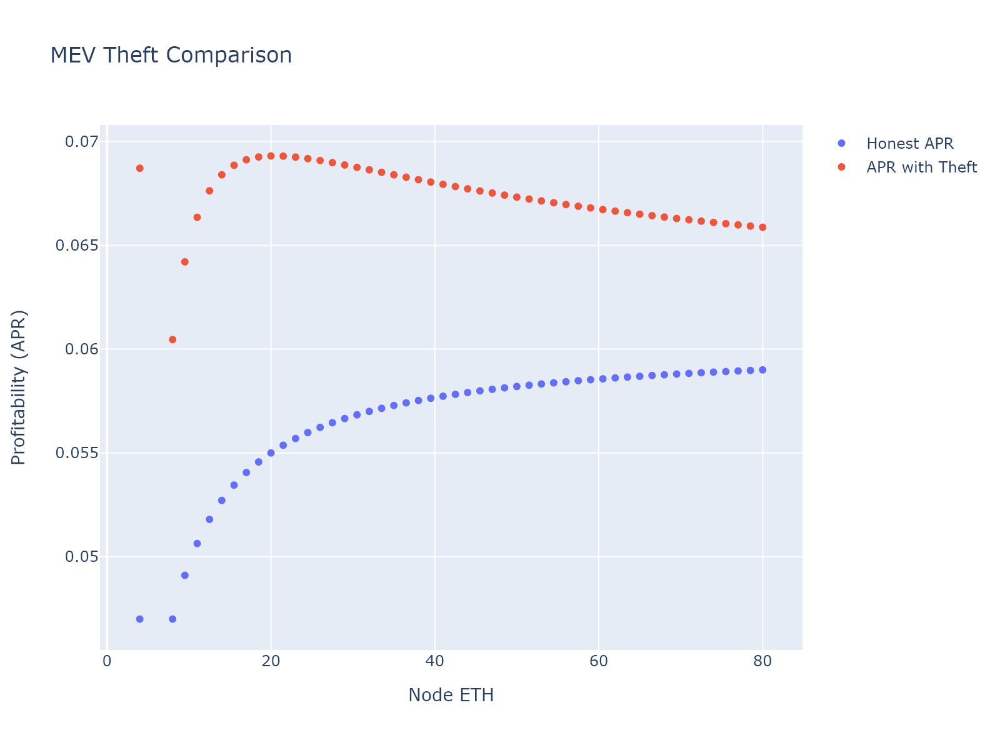
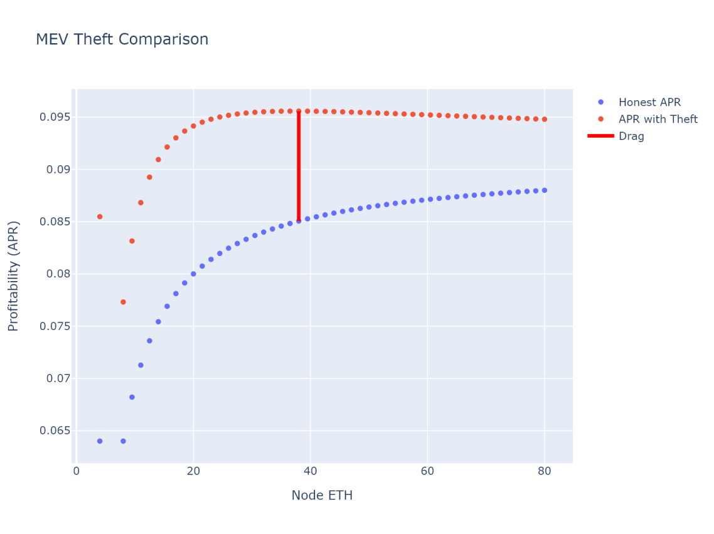

## Abstract
This proposal dramatically increases the LTV used in the protocol (loan to value; the amount of ETH that can be borrowed per unit of bonded ETH). It does this safely by:
- Enabling node-level penalties to mitigate/discourage MEV theft
- Using forced exits as needed
- Starting with lower LTV at lower total bonded ETH to mitigate/discourage MEV theft
- Retaining sufficient bond per validator regardless of total stake to mitigate against slashing and abandonment 
- Providing increased capital efficiency with greater bond to encourage an NO to stake as large nodes instead of many small nodes

This proposal also explicitly tries to benefit the smallest NOs a few ways, in line with the pDAO charter values of decentralization and prioritizing Ethereum health (see [RPIP-23](./RPIP-23.md)):
- We willingly take on somewhat more MEV-theft risk for the smallest NOs (see [Rationale](#rationale))
- We give precedence to small nodes staking some number of initial validators in the Node Operator queue 
- There is a small but tangible financial benefit to large stakers to stake as large nodes instead of many small nodes -- this (alongside our vote power, which scales with the square root of vote-eligible RPL) helps preserve the strong governance voice of small NOs

This work is based on prior work; a copy can be found [here](../assets/rpip-42/bond_curves.md).

## Specification
- The oDAO SHALL be able to penalize stake at the node level when a [Penalizable offense](#penalizable-offenses) is committed
- Legacy minipool deposits SHOULD be disabled
- When Node Operators create validators, with `i` validators in the megapool prior to adding:
  - If `i < base_bond_array.length`: the required `user_deposit` is the amount of additional ETH to bring the user's total bond up to `base_bond_array[i]`.
  - If `i ≥ base_bond_array.length`:, the required `user_deposit` is `reduced_bond` per validator.
- When Node Operators remove validators, with `i` validators in the megapool prior to removing:
  - If `i > base_bond_array.length`: the Node Operator share before penalties is `reduced_bond`.
  - If `i ≤ base_bond_array.length` and `i > 1`: the Node Operator share before penalties is the amount of ETH that would bring the user's total bond down to `base_bond_array[i-1]`.
  - If `i==1`: the Node Operator share before penalties is the amount of ETH that would bring the user's total bond down to 0 ETH.
- When a validator is added with a deposit from `base_bond_array`, it SHALL receive priority treatment for any queues vis-à-vis validators added with a `reduced_bond` deposit.
- Bulk validator creation / removal functions SHALL behave the same as multiple individual transactions.
- It SHALL be possible to exit the node operator queue and receive ETH `credit` for it
- If there is enough ETH in the deposit pool to launch a validator (when added to the NO's deposit), it SHALL NOT be possible to enter the node operator queue (ie, immediately move past the queue and into the next phase)
- If an NO has more total bonded ETH in their megapool than would be necessary based on the current settings (eg, `reduced_bond` is reduced), it SHALL be possible to reduce their bonded ETH and receive ETH `credit` for it
- `credit` MUST be usable to create validators in a megapool
- `credit` MUST be usable to mint rETH to the NO's primary withdrawal address 
- The initial settings SHALL be:
  - `base_bond_array`: [4, 8]
  - `reduced_bond`: 4 ETH

## Specification taking effect with Saturn 2
- Update `reduced_bond` to 1.5 ETH

## Penalizable offenses
This portion of the RPIP SHALL be considered Living. It may be updated by DAO vote.

| Offense   | Penalty              | Added      | Updated    |
|-----------|----------------------|------------|------------|
| MEV theft | theft size + 0.2 ETH | 2024-03-29 | 2024-03-29 |

## Rationale
- Bond sizes were originally ideated per [prior work](../assets/rpip-42/bond_curves.md).
  - `base_bond_array` is chosen to "sufficiently" dissuade MEV theft as a strategy
  - `reduced_bond` is chosen to "sufficiently" guard against slashing or abandonment risks
- Follow-on work was done in [discord](https://discord.com/channels/405159462932971535/1228753782402318427/1228914436924772352)
  - The plots below show `base_bond_array`=[4, 8] and `reduced_bond`=1.5. As we can see, MEV theft always increases yield and the impact is heightened at low commission. The reality is, we've seen very little of this type of behavior. We may have to change our approach if we see MEV theft increase or if we wish to support NO commission share under 2.5% .
  - A moderate step would be to simply change base_bond_array to a curve that reduces MEV theft advantage in the current context (commission, MEV landscape...) at the cost of user complexity, eg `[4.2, 6.8. 9.2. 11.4. 13.5. 15.5. 17.4]`
  - A larger step would be to pass EL rewards to NOs and charge them for the benefit. See eg: <https://github.com/Valdorff/rp-thoughts/tree/main/leb_safety#negative-commission-aka-assign-execution-layer-rewards-to-nos> or <https://dao.rocketpool.net/t/reimagining-large-block-theft/2146>

| 2.5% commission                                 | 4% commission                                |
|-------------------------------------------------|----------------------------------------------|
|   |  |

- Note that the bond curve has been chosen to ensure that minimum size sock puppets are _not_ most efficient for theft. They get the most _advantage_ from theft, but not the highest overall yield from a dishonest strategy.
- Validators with `base_bond` deposits are prioritized to promote decentralization; new or smaller Node Operators can get up to `base_bond_array.length` validators launched ahead of larger Node Operators adding `reduced_bond` validators.

## Copyright
Copyright and related rights waived via [CC0](https://creativecommons.org/publicdomain/zero/1.0/).
