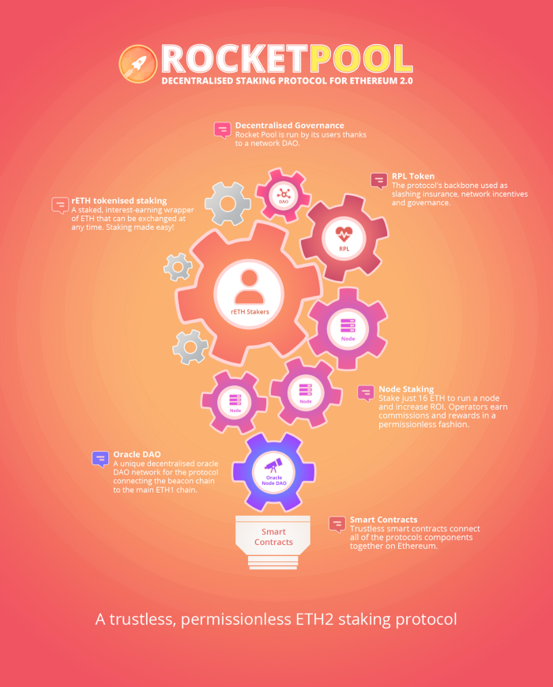

## Abstract
Rocket Pool governance is divided into three distinct DAO units, each with their own duties: the Oracle DAO (oDAO), the Protocol DAO (pDAO), and the Rocket Pool community DAO (RPDAO). This document describes these organizations, their purpose, and their operations at a high level.

For a more technical overview of Rocket Pool, see RPIP-2.
  

## Rocket Pool DAO (RPDAO)

The RPDAO is the main mechanism for the community at large to engage with Rocket Pool. As such, the RPDAO is the organization which captures community sentiment surrounding proposals and enacts them as dictated by the RPDAO voting process. The RPDAO governs itself using the mechanisms described in [RPIP-4](RPIP-4.md). 
  
The RPDAO is responsible for overall project governance and meta-governance intitiatives, such as the RPIP editing process, and it is responsible for the enactment of successful, finalized proposals through whatever means possible. It also has ultimate authority over the existance and structure for the pDAO and oDAO, though these organizations also have their own on-chain governance mechanisms.
  
## Oracle DAO (oDAO)

The oDAO is responsible for accurate record-keeping of several data points on-chain for use by the Rocket Pool protocol's smart contracts. Most importantly, this includes a consensus on the price of the RPL token.

The oDAO governs itself via an on-chain system which allows members to achieve consensus on the RPL token price and includes penalties for failing to achieve consensus. oDAO members may vote to onboard or kick out other members. These duties are remunerated via RPL token inflation.

## Protocol DAO (pDAO)
  
The pDAO is responsible for the adjustment of protocol parameters such as node commission rate and upgrading protocol smart contracts.

On-chain pDAO governance is not implemented yet, and therefore, the RPDAO is still responsible for manually performing these duties.

## Copyright
Copyright and related rights waived via [CC0](https://creativecommons.org/publicdomain/zero/1.0/).
