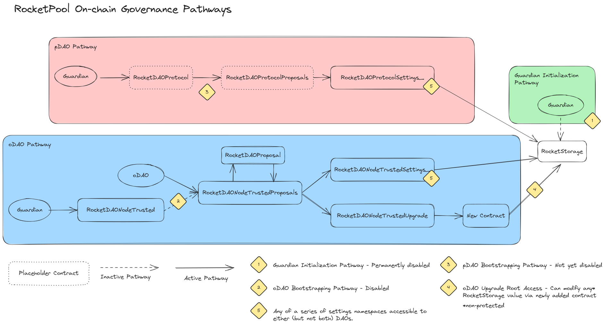

## Abstract
    
This RPIP serves as a guide to understanding the governance processes of the Rocket Pool protocol. It provides an overview of the powers and authorities held by various governance actors, including the oDAO, pDAO, established committees, and other relevant roles. 

## Motivation
    
This informational document seeks to clarify the existing governance structure and delineate the powers and authorities of established entities clearly, to ensure transparency and efficiency in Rocket Pool’s decision-making process. We believe doing so will also positively affect:
- Ease of onboarding new contributors to Rocket Pool Governance.
- General knowledge about the protocol and how it operates.
- Ability to identify stakeholders and their responsibilities.

In short, having better baseline information improves the quality of contributor life for the protocol, and establishing this work as an informational RPIP would make it easier to access and trust the validity of the described areas.

## Specification

### Definitions

There are several terms used in this document that are worth defining explicitly to avoid misunderstanding and ambiguity.

#### Principal

An individual or entity that can be said to ‘own’ the protocol.

#### Agent

An individual or entity that provides some service to the principals, or holds power delegated by the principals.

#### Power

Power in this document is used to refer to the raw capability to do something. This refers to explicit permissions granted in the protocol’s smart contracts, administrative access to software platforms, and so on.

A principal or agent has the power to perform action X when every limitation to their role in performing action X is self-applied, rather than being applied by another party.

To give an example, the oDAO has the power to make changes to the Rocket Pool Protocol due to the permissions trustedNodes (in aggregate) hold in the protocol contracts, and because the limitations to the oDAO ratified by the pDAO are self-applied by the oDAO.

Best expressed in the phrase: ‘Are we able to do X?’

#### Authority

Authority in this document is used to refer to the right to do something. This refers to the implicit and explicit decisions made by the community at large as to ‘who do we want to do X’.

Authorities are a bit complex in that they often stem from a string of decision-making powers, some explicit and some explicit. This document seeks to document what clear authorities exist based on approved governance actions and their ramifications, but may not be able to capture the full intricacy of who has the "right" to take an action.

A principal or agent has the authority to do X if the Rocket Pool community has explicitly or implicitly agreed that that principal or agent is allowed or supposed to be doing X.

To give an example, the pDAO has the authority to make changes to the Rocket Pool Protocol due to the shared understanding of the community that registeredNodes are the ‘principals’ of the Rocket Pool protocol.

Best expressed in the phrase: ‘Are we allowed to do X?’

### Principals and Agents

#### oDAO governance

##### Description

OracleDAO governance is defined as successful on-chain governance proposals voted on by oDAO members running oDAO nodes.

##### Powers

* The oDAO has the power to replace any contract (except RocketStorage) in the Rocket Pool protocol via the oDAO upgrade power.
* The oDAO has the power to modify any non-protected parameter in the Rocket Pool protocol via the oDAO upgrade power.
* The oDAO has the power to call core contract functions protected by the generic ‘onlyLatestNetworkContract’ required via the oDAO upgrade power. This has several implications, most notably:
  * The ability to withdraw RPL and ether from the RocketVault contract.
  * The ability to withdraw ether from the RocketSmoothingPool contract.
  * The ability to set the Minipool penalty within the bounds of the maximum penalty.
* The oDAO has the power to modify oDAO settings via the oDAO settings pathway.
* The oDAO has the power to take actions that modify the membership of the oDAO.
* The oDAO has the power to determine the split of RPL inflation via consensus on a rewards Merkle tree. [[GitHub](https://github.com/rocket-pool/rocketpool-research/blob/v6/Merkle%20Rewards%20System/rewards-calculation-spec.md)]
* The oDAO has the power to withdraw ETH at no cost from the deposit pool contract, via manipulation of the rETH exchange rate. [[Etherscan](https://etherscan.io/address/0xDD3f50F8A6CafbE9b31a427582963f465E745AF8)]
* The oDAO has the power to withdraw ETH at no cost from the rETH token contract via manipulation of the rETH exchange rate. [[Etherscan](https://etherscan.io/address/0xDD3f50F8A6CafbE9b31a427582963f465E745AF8)]
* The oDAO has the power to approve the canonical rewards Merkle tree at the end of each reward period. [[Etherscan](https://etherscan.io/address/0xA805d68b61956BC92d556F2bE6d18747adAeEe82#code#F1#L165)] This uses a separate governance pathway. 

##### Authorities

* oDAO has the authority to veto changes approved by the pDAO if they have reason to believe the changes meet any of the following criteria according to [[RPIP-24](RPIP-24.md#odao-values)]:
  * Malicious
  * Not voted by the pDAO
  * A result of vote manipulation in the pDAO
  * Would result in clear damage to the Rocket Pool project
* The oDAO has the authority to maintain its own membership. [[RPIP-24](RPIP-24.md#odao-values)]

#### Guardian

##### Description

The guardian address is an EOA defined in the RocketStorage contract (but outside the key-value mappings.) It was responsible for the initialization of the protocol. Some of its initial powers have been irrevocably disabled, while others are still active at the time of writing.

The guardian address is likely controlled by Rocket Pool Pty Ltd.

##### Powers

* The Guardian address has the power to modify pDAO settings via the pDAO settings pathway.
* The Guardian address has the power to modify the share of RPL inflation via the pDAO bootstrap pathway.
* The Guardian address has the power to spend the RPL tokens allocated to the pDAO via the pDAO bootstrap pathway.
* The Guardian address has the power to set the maximum penalty rate for minipools via the RocketMinipoolPenalty contract.

#### Authorities

No authorities have been assigned to the guardian address by the pDAO. Indirect authorities are inherited from the assumption that the guardian is controlled by Rocket Pool Pty Ltd and are listed in that section.

#### pDAO governance

##### Description

ProtocolDAO governance is defined as successful governance proposals voted on by Rocket Pool community members running Registered Nodes.

##### Powers

The pDAO currently has no direct, on-chain power over the Rocket Pool protocol.

##### Authorities

The pDAO as a collective is considered the principal of the Rocket Pool protocol. Authority over the Rocket Pool protocol lies with the pDAO, except that which relates to the oDAO, which maintains authority over itself. Changes to the protocol are only allowed to be done through following the pDAO's governance process.  

Its authorities include, but are not limited to:

* The authority to add, remove, replace, or amend RPIPs.
* The authority to determine the membership of committees defined by RPIPs.
* The authority to add, remove, or upgrade the functionality of the Rocket Pool protocol.
* The authority to determine the distribution of RPL inflation.
* The authority to engage agents on its behalf.
* The authority to delegate specific authorities to separate governance processes.

#### Individual Registered Nodes (oDAO or pDAO)

##### Description

Any individual Rocket Pool Registered Node. All Trusted Nodes (oDAO) are also Registered Nodes (pDAO).

##### Powers

* Registered Nodes have the power to challenge an individual oDAO member to ensure they are fulfilling their responsibilities. [[Etherscan](https://etherscan.io/address/0x029d946F28F93399a5b0D09c879FC8c94E596AEb#code)]
* Registered Nodes have the power to become oDAO members unilaterally if there are less than 3 oDAO members. [[Etherscan](https://etherscan.io/address/0xb8e783882b11Ff4f6Cef3C501EA0f4b960152cc9#code)]
* Registered Nodes have the power to accept an invitation to the oDAO. [[Etherscan](https://etherscan.io/address/0x029d946F28F93399a5b0D09c879FC8c94E596AEb#code#F1#L144)]

##### Authorities

There are no protocol-affecting authorities held by individual Registered Nodes.

#### Rocket Pool Pty Ltd

##### Description

Rocket Pool Pty Ltd is the legal entity that created and deployed the Rocket Pool Protocol. It retains relevant intellectual property rights and is currently acting as a conservator while powers and authorities are transferred to the less centralized DAO structures.

##### Powers

* Rocket Pool Pty Ltd has the power to moderate and modify the Rocket Pool Discord Server.
* Rocket Pool Pty Ltd has the power to moderate and modify the Discourse forum instance.
* Rocket Pool Pty Ltd has the power to add and remove documentation to the official documentation page.
* Rocket Pool Pty Ltd has the power to administer the Rocket Pool Github organization.
* Rocket Pool Pty Ltd has the power to administer and author polls on the Rocket Pool Snapshot instance. This includes the ability to add or modify voting strategies.

##### Authorities

As founder of the protocol, Rocket Pool Pty Ltd has broad implied authority in areas where the pDAO has not claimed or revoked it. 

While the full social authorities for the company are hard to capture due to the autonomy granted to the organization, the following categories are backed up by potential court proceedings:

* Domain names
    * Important domains include:
        * dao.rocketpool.net (forum)
        * stake.rocketpool.net (user-facing staking site)
        * delegates.rocketpool.net (delegate profiles)
* Trademarks
* Sanctioning of the [bug bounty program](https://immunefi.com/bounty/rocketpool/).

##### Software Pipeline

The powers and authorities above can be quite broad-reaching but may cover up some important explicit procedures of trust carried by Rocket Pool Pty Ltd.

- Rocket Pool Pty Ltd verifies updates to the [Smartnode Repository](https://github.com/rocket-pool/smartnode) and releases them with the expectation that node operators will manually update to new releases.

#### RPIP Editors

##### Description

RPIP Editors are tasked with ensuring RPIP documents are finalized and correctly formatted before voting. The position is apolitical, with RPIP Editors not making value judgments in their duties, but rather evaluating based on completeness and format. [[RPIP-1](RPIP-1.md#rpip-editor-responsibilities)]

##### Powers

* RPIP Editors have the power to modify RPIPs.
* RPIP Editors have the power to determine RPIP status.

##### Authorities

* RPIP Editors have the authority to determine when an RPIP is “sound and complete.”
* RPIP Editors have the authority to assign an RPIP number.
* RPIP Editors have the authority to require title changes to RPIPs.
* RPIP Editors have the authority to determine RPIP status.
* RPIP Editors have the authority to require updates to an RPIP's formatting, spelling, and markdown style.

#### GMC

##### Description

The Grants Management Committee exists to distribute grants and bounties, retrospectively and prospectively, to further the goals of the Rocket Pool protocol. Bound by [[RPIP-26](RPIP-26.md)], this committee must consist of nine members.

##### Powers

* The GMC has the power to use funds sent to the GMC’s multisig.
* The GMC has the power to add or remove an address from the GMC’s multisig.

##### Authorities

* The GMC has the authority to distribute its share of the pDAO’s budget on a rolling basis, in the form of grants, bounties, and retrospective awards.
* The GMC has the authority to remove a GMC member with a vote of ⅔ of the committee so long as it does not violate the multisig requirements agreed by the pDAO [[RPIP-10](RPIP-10.md#management-committee-governance)].
* The GMC has the authority to select a GMC Administrator for the committee, through a majority vote of current GMC members.
* The GMC has the authority to select an interim GMC Administrator in the event of a vacancy.
* The GMC has the authority to remove the GMC Administrator through a majority vote.

#### GMC Administrator

##### Description

The Grants Management Council Administrator is responsible for overseeing and facilitating GMC operations, specifically the rolling awards process introduced by [[RPIP-26](RPIP-26.md#expanded-gmc-administrator-role)]. The GMC Admin is expected to perform various tasks supporting the efficiency of the GMC such as meeting coordinator, awards facilitator, spokesperson, grants and bounties liaison, treasurer, and governance author.

##### Powers

* The GMC Administrator has no direct, on-chain power over the Rocket Pool protocol.
* The GMC Administrator has no power over funds sent to the GMC multisig.

##### Authorities
* The GMC Administrator has the authority to coordinate the voting members of the GMC.
* The GMC Administrator has the authority to interact with parties external to the GMC on its behalf.

#### IMC

##### Description

The Incentives Management Committee oversees funds and liquidity incentives for Rocket Pool. Primarily its goal is to support rETH liquidity with a secondary focus on RPL liquidity. [[RPIP-20](RPIP-20.md)]

##### Powers

* The IMC has the power to use funds sent to the IMC’s multisig.
* The IMC has the power to add or remove addresses from the IMC’s multisig.

##### Authorities

* The IMC has the authority to distribute funds for supporting rETH liquidity up to the annual allocation determined in [[RPIP-20](RPIP-20.md)].
* The IMC has the authority to distribute funds for supporting RPL liquidity up to 10% of the annual allocation determined in [[RPIP-20](RPIP-20.md)].
* The IMC has the authority to remove an IMC member with a vote of ⅔ of the committee so long as it does not violate the multisig requirements agreed upon by the pDAO. [[RPIP-10](RPIP-10.md)]

#### pDAO Treasurer

##### Description

pDAO Treasurer is a position appointed by [[RPIP-10](RPIP-10.md)] that is responsible for reporting on pDAO expenditures.

##### Powers

The pDAO Treasurer has no direct, on-chain power over the Rocket Pool protocol.

##### Authorities

* The pDAO Treasurer has the authority to classify expenditures to the greater community.
* The pDAO Treasurer has the authority to cast the tie-breaking vote in an interim GMC Administrator election. [[RPIP-26](RPIP-26.md)]
* The pDAO Treasurer has the authority to randomly select from tied candidates in committee member elections. [[RPIP-10](RPIP-10.md)]
    
#### Appendix
    
##### Technical Design of Governance
    
On the technical side, governance of the Rocket Pool protocol is achieved via several main pathways:

* The pDAO settings pathway (change pDAO settings)
* The oDAO settings pathway (change oDAO settings)
* The oDAO upgrade pathway (add/remove/replace contracts)
* The Guardian initialization pathway (no longer usable)

At the time of writing, the ‘owners’ of each pathway are:

* pDAO settings pathway - Guardian address
* oDAO settings pathway - oDAO
* oDAO upgrade pathway - oDAO
    

    
Usage of the oDAO pathways to do anything requires a majority vote from oDAO members. While a delay is imposed post-proposal-prior-to-vote, there is no post-vote-prior-to-execution time lock present in the Rocket Pool protocol at the time of writing.

The Guardian address has the power (but not authority) to use the pDAO settings pathway at will with no delay.

The settings referred to above are all entries in a key-value store found in the RocketStorage contract.

A list of all contracts considered part of the Rocket Pool protocol is stored in a key-value store in RocketStorage. Any contract within this list has write access to all key-value stores within RocketStorage. Protocol contracts read relevant keys from RocketStorage when executing their functions. Consequently, RocketStorage stores the canonical state of the Rocket Pool protocol.
    
## References
 
[RPIP-1](RPIP-1.md)  
[RPIP-4](RPIP-4.md)  
[RPIP-10](RPIP-10.md)  
[RPIP-20](RPIP-20.md)  
[RPIP-24](RPIP-24.md)  
[RPIP-26](RPIP-26.md)  

## Copyright
Copyright and related rights waived via [CC0](https://creativecommons.org/publicdomain/zero/1.0/).
