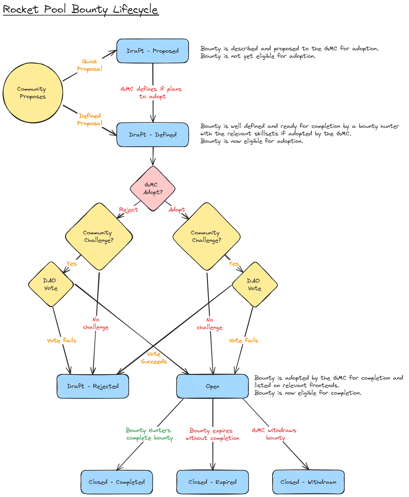

## Abstract

TODO Write

## Motivation

TODO Write

## Specification
The key words “MUST”, “MUST NOT”, “REQUIRED”, “SHALL”, “SHALL NOT”, “SHOULD”, “SHOULD NOT”, “RECOMMENDED”, “MAY”, and “OPTIONAL” in this document are to be interpreted as described in RFC 2119. TODO Remove

### Bounty Lifecycle

#### Statuses
**Draft - Proposed** - Bounty is described and proposed to the GMC for adoption. Bounty is not yet eligible for adoption.  
**Draft - Defined** - Bounty is well defined and ready for completion by a bounty hunter with the relevant skillsets if adopted by the GMC. Bounty is now eligible for adoption.  
**Draft - Rejected** - Bounty was rejected by the GMC at this time. Bounty is not eligible for completion.  
**Open** - Bounty is adopted by the GMC for completion and listed on relevant frontends. Bounty is now eligible for completion.  
**Closed - Completed** - A Bounty has been fully completed and paid out by the GMC. Bounty is no longer eligible for completion.  
**Closed - Expired** - Bounty has met its expiration date. Bounty is no longer eligible for completion.  
**Closed - Withdrawn** - GMC has withdrawn the bounty. Bounty is no longer eligible for completion.  

### Bounty Incentive Levers
Bounty Incentives Levers are OPTIONAL incentives that the pDAO empowers the GMC to use to incentivise the generation and successful completion of bounty proposals.

#### Lever Incentives
* The incentive attached to each lever MAY be set by the GMC. 
* Levers MAY have an absolute (fixed amount) component and/or a relative (percentage of total bounty payout) component. 
* The payout of incentives for a given bounty MUST NOT reduce the bounty completion payout. 
* When incentive levers are modified by the GMC, incentives SHOULD be paid out in such a way that ambiguity favours incentive recipients.
* The total cost of lever incentives is not fixed. The GMC SHOULD set lever incentives with caution when funds are limited. 

#### Payout
* Bounty incentives SHOULD be paid out of the GMC budget.
* Incentive payouts SHOULD take place within the GMC's regular payout schedule.
* Incentive payouts MUST be denominated in dollars, and MUST be paid out in one of the GMC's accepted payout token options selected by the recipient.

#### Lever A: Proposal Incentive
The proposal incentive lever aims to influence the number of bounty proposals that are recieved by the GMC.
* This incentive MUST be paid to the proposal author for a bounty proposal that is adopted by the GMC. 
* Individual incentive payouts for this lever MAY be reduced at the GMC's discretion based on proposal quality and completeness.
* Bounty definitions do not need to be included for a proposer to recieve this incentive.

#### Lever B: Definition Incentive
The definition incentive lever aims to influence the quality and completeness of bounty definitions accompanying bounty proposals.
* This incentive MUST be paid to the definiton author for bounty definitions provided alongside a bounty proposal that is adopted by the GMC. 
* This incentive payout SHOULD be paid a maximum once per proposal, even if the bounty proposal is split into multiple definitions.
* Individual incentive payouts for this lever MAY be reduced at the GMC's discretion based on definition quality and completeness.
* This incentive SHOULD go to the proposal author unless an alternative is explicitly preapproved by the GMC adminitrator.

#### Lever C: Completion Incentive
The completion incentive lever aims to influence the quality and consistency of bounty work submitted by bounty hunters. It aims to do this by rewarding contacts that support, oversee and assist bounty hunters meet the requirements of open bounties. 
* This incentive SHOULD be split equally between bounty contacts that meet the following conditions:
  1. The bounty MUST be completed to the satisfaction of the GMC.
  2. The contact MUST be publicly listed in the bounty definition of the completed bounty.
  3. The contact MUST NOT be affiliated with the completing bounty hunter.
  4. The bounty hunter does not comment negatively on the contact when asked by the GMC.
* Contacts SHOULD NOT assist the bounty hunter directly with the bounty work.
* Contacts SHOULD assist bounty hunters via feedback, direction and oversight upon request.
* Individual incentive payouts for this lever MAY be reduced at the GMC's discretion for any reason. Reasoning must be publicly stated by the GMC.

#### Initial Lever Recommendations
These are non-binding recommendations to the GMC for initial incentive lever settings. They are included as a starting point for discussions, and are not intended to limit GMC decision-making on the issue.
* For the first few months, levers SHOULD be set to higher levels, with the goal of reaching a meaningful number of open bounties.
* Lever A and B SHOULD NOT be zero unless unallocated GMC funds are low.
* Lever B SHOULD be higher than Lever A, in order to incentivize well defined bounty generation.
* Lever B SHOULD have a relative component, as higher-value bounties should be expected to have longer, more strict, and less ambiguous definitions.
* Lever C SHOULD be a focus for experimentation. It is difficult to know how useful or effective it will be without empirical testing.
* Relative values SHOULD be less than 10% of the total bounty value under normal circumstances.

### Templates and Guidelines

Initial guidelines and templates have been provided to the GMC where not already present. The GMC will maintain these and ensure they are accessible to the community. 

Links to the relevant documents are provided here for reference. These documents are not considered to be ratified by the pDAO, and can be modified by the GMC as required.

* Bounty Proposal Template + Guidelines (TODO ADD LINK)
* Bounty Definition Template + Guidelines (TODO ADD LINK)

## Rationale

TODO Write

## Backwards Compatibility
Existing bounties have been given rough definitions already. Upon ratification of this RPIP, these rough definitions will be firmed up and their contents approved by the GMC.

## Copyright
Copyright and related rights waived via [CC0](https://creativecommons.org/publicdomain/zero/1.0/).
