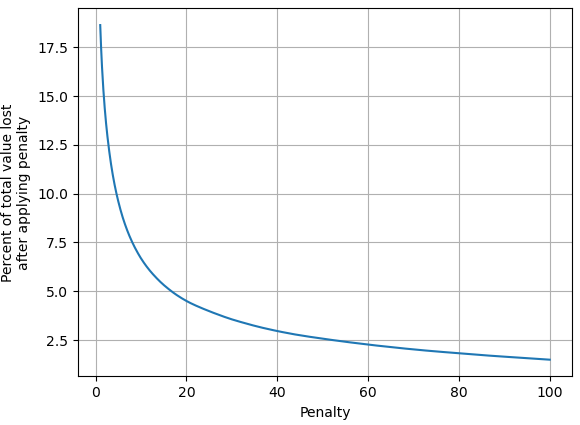
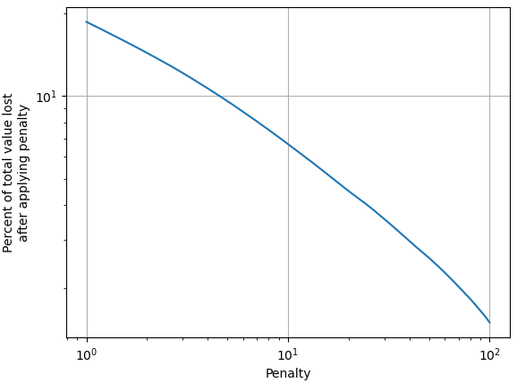
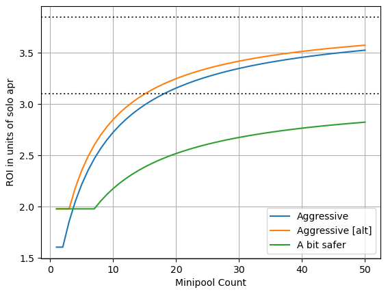

This is a snapshot of https://github.com/Valdorff/rp-thoughts/blob/main/2023_11_rapid_research_incubator/bond_curves.md for the RPIPs repository. 

----

This writeup is meant to address "Rapid Research Incubator" topic #3 (Mechanisms and feasibility requirements for lowering ETH bond requirement for minipools). It will explore what minimums are needed for what levels of safety, a mechanism for lowering the ETH bond, and some suggested numbers.

## Safety and bond

### MEV component
Using flashbots data from slot-4629154 to slot-6206500, and tweaked code from `leb_safety`, we can see how much value would be lost under a few assumptions (see leb_safety for the exact assumptions). We assume the MEV market is quite hot (~3x hotter than it's been). We assume everyone is trying to steal all the time and perfectly capable of it at a level matching flashbots' builders. We assume we can force exit the validators after this point so there is no further loss.

|  |  |
|:-------------------------------------------:|:---------------------------------------------------------:|

The main thing to note here is that worst-case protocol damage falls off rapidly with additional penalty. Note that not everyone is actually trying to be bad (in fact, very few are), so this is likely a bit of a doomer look at things. 

To get some context for what we're willing to accept, we have previously set the deposit pool to a size that accepts a ~5% drag.

Let's zoom in a bit:\

A few points have been highlighted showing the amount penalizable needed for 5% as well as 10% and 15% -- these numbers would be an opinion like "there's 2x or 3x too much worst case in the assumptions". Eg for 2x could be "no more than half of RP validators are capable thieves".

### Slashing
Here a Lido research team conclude that 3.79 ETH is sufficient to avoid all losses with no more than 3.13% of the network experiencing a slash: https://youtu.be/duGBckg_JNE?t=857. They are using nice conservative numbers (high APRs and long exit queues).

Let's look at how Lido and RP would fare in this 3% correlated slashing. Lido currently have ~289k validators with about 6k ETH of insurance. If 3% of their validators lost 3.79 ETH each, that would cost 32.8k, which means a hit to the LST of 0.3%. If RP have 1.5 ETH per validator (the most aggressive I'm at all thinking through), a 3% correlated slashing would result in a hit to the LST of 0.2%. Awesome. Let's ignore this scenario entirely.

The other case I want to look at is a grief slashing -- here there is no reason to expect much correlation. As long as less than 1.04% of the network is experiencing a slash, the midterm penalties will be 0 ETH, and 1.79 ETH will cover it. Another reference point would be with the current worst-case exit queue of ~6 days and the current apr of ~3% CL and 1% EL: that would be 1.033 ETH.

### Abandonment
Abandonment is the next worst case. I would suggest that we use programmatic EL exits if an NO's validator drops below 31 ETH (counting any NO debt to RP as negative) lower than 31 ETH. This would be enough to cover leakage + debt to rETH to make them whole for about 6 months at 4% apy: `32*.04*(6/12)*1.645 = 1.05 ETH`.

## Putting it together

- Scenario: MEV theft + griefing slash
  - Aiming for 10% threshold, we need 4.5 ETH that we can penalize on the node
  - We also need 1-1.79 ETH per validator for the grief slash; let's use 1.5 ETH
  - This means we could allow a first validator with 6 ETH of bond, and subsequent validators at 1.5 ETH of bond.
- Scenario: 2-3% correlated slashing
  - We're significantly better than our competition even with just 1.5ETH per validator
  - Ignore this scenario.
- Scenario: abandonment + griefing slash
  - We need ~1.05 + 1.5 ETH = 2.55 ETH per validator
  - This is self-damaging to the NO in the extreme -- unlike the MEV theft where the penalty has left them with nothing or near it and griefing therefore has no cost, here it's costly.
  - Ignore this scenario
- Scenario: abandonment
  - We need ~1.05 ETH per validator

## Suggested numbers
- Aggressive
  - The first minipool must be an LEB6
  - Thereafter allow LEB1.5s
  - If there's theft, we'll need to force exit everything
  - This hits the "10% value loss" with the worst case assumptions -- we essentially have to believe that won't be the case because of some combination of
    - Not everyone is a thief ethically
    - Not everyone is a thief due to technical skills
    - MEV won't be ~3x as hot as historic
  - This does not get significantly safer with more validators -- the budget is entirely consumed for grief slashing alone
  - This is not safe against the super
- Aggressive [alt]
  - First 2 minipools must be LEB4s
  - Thereafter allow LEB1.5s
  - Ends up with 0.5 ETH more of penalizable bond beyond grief slash budget
  - Allows for users to join with as little as 4 ETH
    - Note that a single LEB4 is around "13% value loss" with the worst case assumptions
    - Essentially we're saying "we value letting small players join and are willing to pay a cost for it." That said, the cost is pretty minimal. Large players _will not_ use single LEB4s to steal. The capital efficiency of more LEB1.5s will outweigh the theft advantage.
- A bit safer
  - The first 6 minipools must be LEB4s
    - This allows small players to join, with "% value loss with the worst case assumptions" decreasing with each validator
  - After those initial minipools, we'll be at "5.31% value loss" with the worst case assumptions
  - Thereafter allow LEB2s
    - Since that's slightly more than the grief slash budget, this means that large players become safer and safer against potential MEV theft with more pools 

## Example ROIs vs solo staking

|  |  |
|:---------------------------------------:|:-----------------------------:|

This assumes 14% commission with all of it going to NO. It accounts for only the ETH bond.

Note how we start at the ROI of LEB6 (1.61) or LEB4 (1.98) and then asymptote towards the ROI of LEB1.5 (3.85) or LEB2 (3.1).