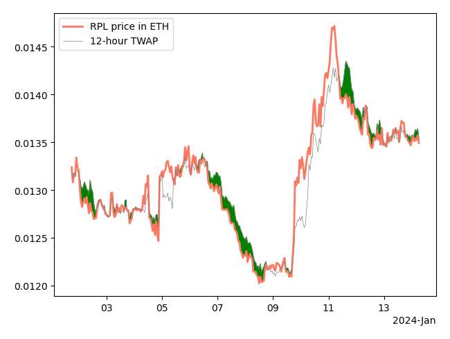

This is a snapshot of https://github.com/Valdorff/rp-thoughts/blob/main/2024_02_strategy/readme_tier2.md for the RPIPs repository. 

----

## Table of Contents
1. [Choose your depth](#choose-your-depth)
2. [Dynamics](#dynamics)
3. [Stepping stones](#stepping-stones)

## Choose your depth
🛑🛑 Please stop for a moment 🛑🛑

This document is the second tier of importance.

If you feel comfortable with everything in the top tier, by all means feel free to continue. But if you don't, please focus on that and ask questions. 

- [Top tier](readme.md)
- [Tier 2](readme_tier2.md)
- [Tier 3](readme_tier3.md)

## Dynamics
A core tenet of this idea is simplicity. It does not have many dynamics as a result. But there's a couple things to keep an eye on: 
- The commission to NOs is set purposely high at 5%. If we grow comfortably and NO supply is never ever an issue, we should lower it (and increase RPL share). This is primarily based on competitive landscape. Based on current outlook, I believe it could go as low as 3% if we meet all our growth goals. My advice to RPLers: don't be short-sighted -- reward NOs enough that they are not blockers to our growth (this is why I'm suggesting starting it at a place that's likely "too generous").
- What do we do if rETH demand slackens before meeting our growth targets?
  - Voters determine whether to spend on demand or not, with the expense coming from RPL. RPL will, ofc, benefit from growth -- so it's very likely that this "spend" is worthwhile.
  - The first way to spend is trivial: reduce the portion to RPL stakers, and rETH's share grows commensurately.
  - The second way to spend allows more fine-grained control. Here we instead increase RPL inflation and spend the RPL in ways that cause rETH demand. For example, we could increase liquidity incentives to rETH/WETH, or incentivize the use of rETH in lending markets.
  - Essentially the question is along the lines of "do I get more TVL on board by increasing the benefit a little to _all_ users, or more significantly to _some_ users"? The answer is difficult to get at and will vary with context.
- There is a conflict of interest with "Voters" being able to change "Voters" slice. I propose our vote also commits to a simple heuristic like:
  - If <40% of RPL is contributing vote power in RP, we SHALL increase this slice
  - if >85% of RPL is contributing vote power in RP, we SHALL decrease this slice
  - if 40-85% of RPL is contributing vote power in RP, we SHALL NOT change this slice
  - require a 2/3 or even 3/4 supermajority vote to change this

## RPL buy+burn thoughts
  - A share of ETH from commission goes to a smart contract 
  - Users may call a function to swap RPL for the ETH in the above contract
  - Swap price is based on on-chain TWAP oracle (eg, [Uniswap v3](https://docs.uniswap.org/concepts/protocol/oracle))
  - Any RPL swapped this way is burned by sending it to `0x000000000000000000000000000000000000dEaD`

Let's visualize what being able to burn looks like in practice using real RPL price data and a simulated TWAP.

We'd expect to burn all our available ETH at the beginning of a downturn (and thereby reduce its severity since that's not market sold). We'd also expect to continue burning against new distributions while price is on a downward slope. On an upward slope, there will be no expected burning until after the top is reached and we turn around for a bit.

--

There have been previous buy+burn mechanics susceptible to gaming. To that end, here's an example design that avoids discontinuties by smoothly unlocking funds for swaps.

The way this works is that:
- New distributions go into the Filling bucket
- After one day has passed, upon the next distribution:
  - Move Unlocking to Unlocked
  - Move Filling to Unlocking
  - Increment bucket_block by one day (repeat as needed until bucket_block > current_block)
  - Put the distribution into filling
- The contract will have `Unlocked + Unlocking + Filling` ETH in it
- The contract will allow burning RPL against `Unlocked + (Unlocking*UnlockingRatio)`
  - `UnlockingRatio = 1 - ((bucket_block - current_block)/blocks_in_one_day)`

Gaming can be avoided by using increasingly larger TWAPs or bucket_block increments (depending on the issue seen). I suspect that 12 hours and 1 day are sufficient.

## Voter share thoughts
I am currently suggesting rewards to be split based on number of RPL contributing to vote power. Since we provide vote power up to 150% of bonded ETH, a node would earn based on `min(1.5*bonded_eth, rpl_value_in_eth)`; their share would be that number divided by the sum of all nodes using that same equation. This is a rather new idea, and there's other variants worth looking at:

- Scale by vote power. This is very intuitive, but rewards sock puppets to avoid the quadratic scaling. In order to go this route, would need to show that the benefits of staying on one node due to bond curves outweigh the benefit of using sock puppets to scale this reward. Imo, it's fine if there's a crossover, as long as the crossover is high (eg, >1k bonded ETH).
- Use a lower maximum for rewards, eg, `min(1.15*bonded_eth, rpl_value_in_eth)`. If the quadratic method can't be done with confidence, a lower maximum may be used to encourage small stakers to have vote power.
- Base on _active governance_ (actually voting/delegating to someone that actually voted) rather just the potential to vote.

## Modeling
I made a [spreadsheet](https://docs.google.com/spreadsheets/d/18cc6smtFn1dETLRuF1RPa4sF8Fx8uOPg41eJn3AaGAA/edit#gid=0) using one methodology and taking quick looks at a handful of scenarios.

Note that this assumes that Buy+Burn and voter rev-share both accrue value equally well and efficiently. This might not be entirely the case. Eg, there may be tax inefficiency on rev-share, buy+burn may only loosely create demand, the set addressable market for voters might be smaller enough that it contributes less demand per return, etc. My belief is that a simple model is more useful than a highly complicated one in most cases, and in the document I compare with the previous overly simple model as well (which also ignored plenty of details). 

This is in the spreadsheet, but I want to re-emphasize this: fundamental value ratio != price by a long shot. See cell A24 for a whole lot of caveats 😛. Shoutout to @luominx, who made an earlier variant of this model for themselves and shared it with me.  

## Stepping stones
We are _currently_ struggling with NO supply. I suggest one of:
- LEB5s with current rules (and DAO-upgradable delegate)
  - Requires an SC release to piggyback on
    - It is not worth an audit cycle or delaying tokenomics rework for this alone
  - Given that forced exits are likely to be possible soon, plan to force exit any remaining LEB5s 2 years after the launch of LEB5s.
  - In my [leb_safety](../leb_safety/readme.md) work, I argue that, without forced exits, we have to defend from MEV theft _plus_ 0.64 ETH per year.
  - For 2 years we need 1.28 ETH plus whatever we're comfortable with assuming we have forced exits. I suggest that's around 4+1.28=5.28 ~= 5 (rounding down is based off of how many "bad case" assumptions are made, but LEB6 works fine too if people prefer)
- RPL loans
  - Fund a multisig with ~10k RPL for the first iteration of this program, which is enough for around ~500 LEB8s
  - Take collateral in the form of rETH/ETH BPTs (balancer liquidity tokens)
  - 2.5 ETH worth of RPL for 1 year; 80% LTV; up-front fee of 10% which is refundable if used "properly"
  - This means a user would:
    - post 3.26 ETH worth of rETH/ETH BPT using their node or withdrawal address
      - 3.01 are locked as collateral 
      - 0.25 are given to the multisig
    - After a year, if the node in question
      - (a) staked the RPL within a week of the loan
      - (b) started an 8-ETH minipool within two weaks of the loan, and
      - (c) kept bonded ETH at the level of (b) or higher for the year the 0.25 ETH fee is sent back to them
  - The assumption is that by the end of the loan term, ETH-only would be an option, so the user could freely repay their RPL and continue participating if that's their preference. If we'd like to do 1.5 years for increased user confidence, that would be fine too.
- Reduce/remove RPL requirement to make minipools
  - This could only be done _after_ a successful vote to new tokenomics
  - The premise is that assets forward price -- so if we have a new value capture mechanism, it should immediately be relevant, even before implementation.
  - If that's the case, we're free to remove the RPL requirement. (If a zero adds complexity, this can be arbitrarily small -- eg 0.1% of borrowed ETH instead of 10%)
  - I would recommend no change to RPL rewards alongside this stepping stone (ie, those still have a 10% borrowed cliff)
  - I believe theory supports this. It also makes me nervous tbh. I think it's worth discussing.