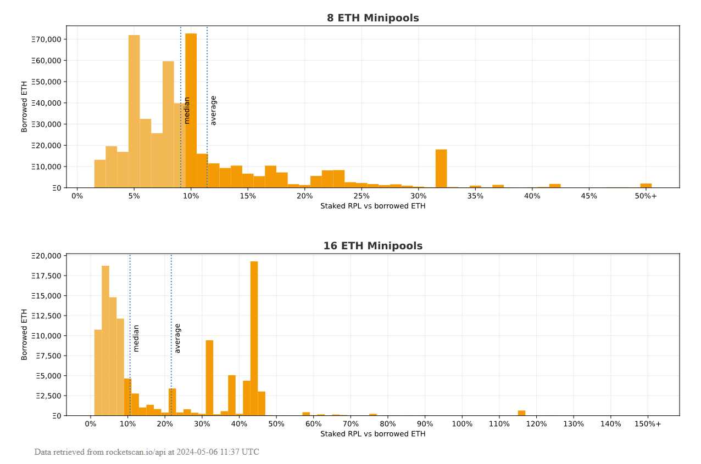
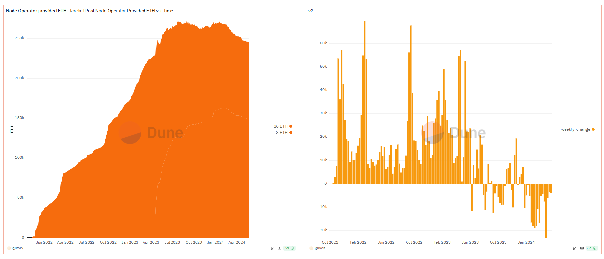




<a href="{{cPrev.url|relative_url}}">Previous - {{cPrev.title}}</a>Previous
<a href="{{cNext.url|relative_url}}">Next - {{cNext.title}}</a>Next

## Choose your depth

- Intro: [Why Rework Rocket Pool's Tokenomics?](./001-why-rework.md)
- Intro: [Introduction to the Tokenomics Rework](./002-rework-intro.md)
- Core: [Foundation of the Tokenomics Rework](./003-rework-foundation.md)
- Intermediate: [Supporting components of the Tokenomics Rework](./004-rework-support.md)
- Advanced: [RPIP-49](../RPIPs/RPIP-49.md) tokenomics spec overview and linked RPIPs

## History

The current bonding style tokenomics can be traced back to the original Rocket Pool whitepaper and ICO in 2017 where RPL was suggested as a requirement for future node operators. Many stakers flocked to this idea, especially after the release of the Rocket Pool Investment Thesis. The vision was realized by the Fire Eyes team in the much-hyped at the time [Article 3](https://medium.com/rocket-pool/rocket-pool-staking-protocol-part-3-3029afb57d4c). Some modifications would follow, but the overall value capture mechanism of the RPL token has remained unchanged since 2017. 

However, what many thought was a good idea in 2017 has not turned out exactly as anticipated as protocol size has stalled and even reversed. This rework aims to establish a sustainable future direction for the RPL token, stem the outflow of node operators, and provide a path to reach the protocol’s rETH supply targets.

## Original idealized concept
In broad strokes, the current setup is meant to be something like:  
  
**Ideal 1** - RPL stake serves as an entry ticket to ETH commission via the minimum staking requirement to start a minipool (10% of borrowed ETH)  
  
**Ideal 2** - RPL rewards are attractive enough that node operators want to maintain this minimum staking level, so we expect them to stay at or above the minimum by adding RPL as needed
  
**Ideal 3** - In the long run, the fundamental value of RPL trends to what's needed for all minipools to hit this minimum staking level (ie, RPL market cap should be ~10% of rETH TVL)  
  
Unfortunately, over the last few years, we've seen that these ideals do not play out as anticipated.

## Issues seen in reality

### Running minipools is primarily Speculative

Unfortunately, the staking requirement in **Ideal 1** makes the financial success of running minipools overwhelmingly dominated by RPL performance.  
  
Let's assume a minimum RPL LEB8 minipool with 3.8% solo APY[^1].
- If net RPL performance is flat vs ETH, the operator earns a **9% boost** compared to solo staking rewards.
- With -5% net RPL performance, the operator sees a **21% drop** compared to solo staking rewards.
- With +5% net RPL performance, the operator sees a **40% boost** compared to solo staking rewards.
  
RPL value change dominates rewards, and given the volatility in crypto, this is likely to outweigh staking rewards.

### RPL Rewards are not attractive enough for node operators to maintain the minimum

**Ideal 2** is not universally sufficient for node operators to maintain the minimum staking requirement of 10%.  
  
Figure 1 below shows that many node operators simply opt out of topping off their RPL stake.  
  
Further, the metric used for the RPL reward threshold is "RPL staked as a percentage of borrowed ETH", which means there are two ways to requalify for rewards. Top up to increase staked RPL, or exit minipools to reduce borrowed ETH. Some node operators have opted for the second option.
  
 
_Figure 1 - Rocket Pool Minipool Collateralization - [Source](https://harpocryptes.github.io/)_
  
### RPL value will be less than what **Ideal 3** suggests

Because some node operators are not topping off per **Ideal 2**, that means the fundamental value calculation in **Ideal 3** breaks. Eg, if at maturity the average collateral is 5% of borrowed ETH, then RPL’s value would be half the value of a situation that’s identical except the average collateral is 10% of borrowed ETH. As shown in the Figure 1 above, this effect is definitely present.

### rETH TVL is limited

First, operators that exit some of their minipools to get back over the RPL reward threshold damage our ability to supply rETH and grow its TVL.

Second, those who would like to operate for Rocket Pool but are unwilling to speculate on RPL are simply unable to participate because of the RPL speculation built into minipool operation.

Third, this speculation is exacerbated at smaller bond sizes. A 10% borrowed-ETH requirement forces greater RPL exposure as ETH bond size is reduced:
- 16 ETH bond + 1.6 ETH worth of RPL (~9% RPL)
- 8 ETH bond + 2.4 ETH worth of RPL (~23% RPL)
- 4 ETH bond + 2.8 ETH worth of RPL (~41% RPL)
- 1.5 ETH bond + 3.05 ETH worth of RPL (~67% RPL)

All of this combines to reduce rETH TVL, and thus RPL's modeled value.

### The system is brittle

The 10% borrowed-ETH minimum is something the protocol tries to impose upon the market, but fails to make economic sense at maturity.

Consider a mature case with a 3% solo APY and 1.5% RPL value loss per year due to supply inflation. Using the same assumptions as earlier, this results in a **2.3% drop** compared to solo staking rewards. In such a case, there is no reason to make minipools if you can afford solo validators.

This does present a solution as well – the minimum staked RPL can be reduced. Note that this would reduce the RPL to rETH TVL relationship per **Ideal 3**, which means that the cost to avoiding this brittleness is letting go of a relationship that can be known ahead of time.

The market has no way to signal that they’re interested in Rocket Pool at a minimum RPL stake set at 8% borrowed ETH versus 10% borrowed ETH. All we’d see is that the market simply stops making minipools (or even starts exiting them) when the overall package is seen as unattractive. We might already be seeing this happen today, as shown by the supply of node operator ETH in Figure 2 below.

 
_Figure 2 - Supply of Node Operator ETH -  [Source](https://dune.com/invis/rp-neth)_

<a href="{{cPrev.url|relative_url}}">Previous - {{cPrev.title}}</a>Previous
<a href="{{cNext.url|relative_url}}">Next - {{cNext.title}}</a>Next

---

[^1]: ROI is calculated using `((bonded_eth + commision_pct * borrowed_eth) * solo_apy + staked_rpl * net_rpl_performance) / (bonded_eth + staked_rpl)`, where `net_rpl_performance = rpl_reward_apy + rpl_ratio_change`