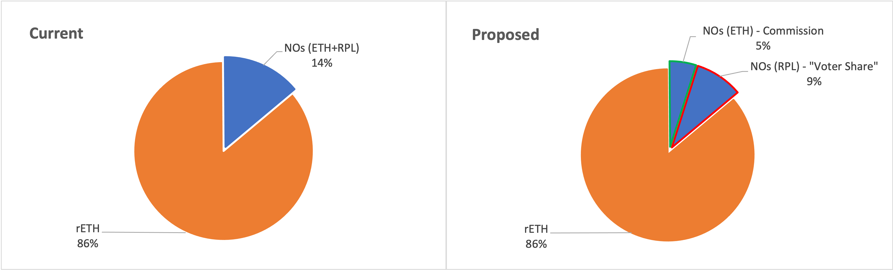
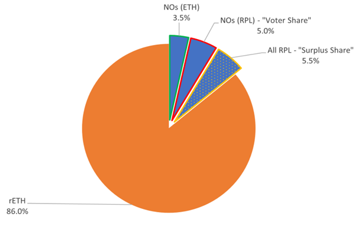
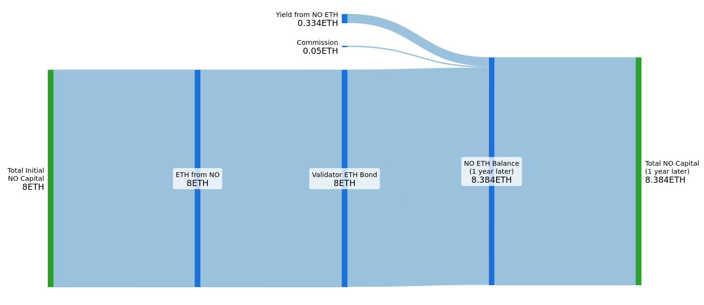
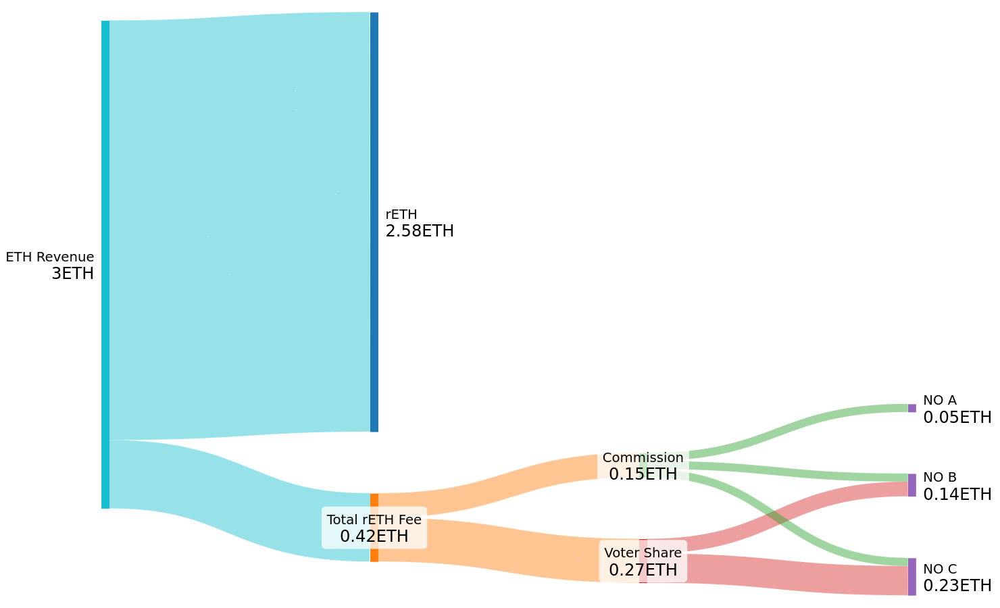
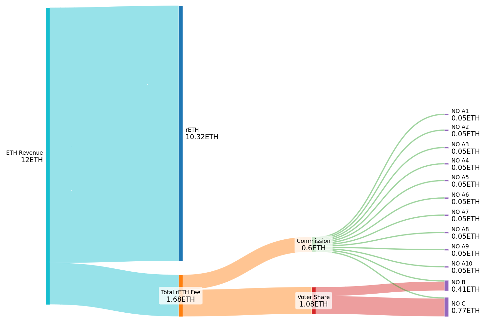
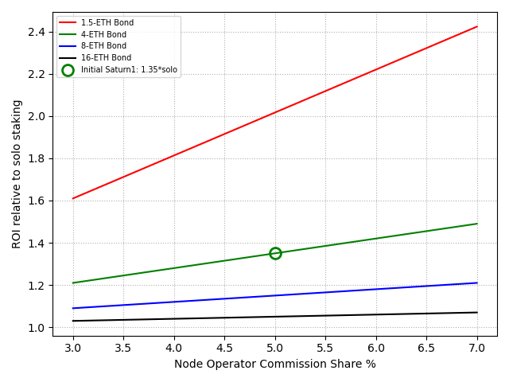




<a href="{{cPrev.url|relative_url}}">Previous - {{cPrev.title}}</a>Previous
<a href="{{cNext.url|relative_url}}">Next - {{cNext.title}}</a>Next

## Protocol Revenue
For this section we'll make two simplifications throughout:

To minimize text/diagram complexity, we assume “RPL buy+burn” as the value capture method for the surplus share. Please see [RPL Value Capture Options](#rpl-value-capture-options) for alternatives and a discussion of their impacts.

While the proposal actually has 4-ETH bonds (and later a mix of 4-ETH and 1.5-ETH bonds), we use 8-ETH bonds in this section to get an apples-to-apples comparison against current 8-ETH minipools.

### Overview
There is only one source of revenue for the protocol, the fee charged to rETH holders. In the current system, this is 14%, paid to Node Operators (NOs), who are required to bring a bond of both ETH and RPL. The proposed rework changes things by creating 3 categories of rewards to distribute this revenue:
- **NOs (ETH) - "Node Operator Commission Share"**. This is paid to all Node Operators in a similar manner as existing validators. One difference is that your eligibility to receive from this share _depends only on your ETH, not on your RPL_ (where previously the Node Operator commission required an initial minimum requirement of both ETH and RPL). This change allows ETH Only NOs.
- **NOs (RPL) - "Voter Share"**. This share is collected from all validators, and then distributed to participants based on their proportional share of vote-eligible RPL. If you stake RPL as a Node Operator, your RPL is eligible for voting, so you would receive a proportional share from this pot of revenue. Importantly this revenue grows with rETH TVL, where growth would allow the same supply of vote eligible RPL to earn more ETH. 
- **All RPL - "Surplus Share"**. This share is collected from all validators, and then used to buy back RPL tokens and burn them. This revenue also grows with rETH TVL, where growth would allow the same supply of total RPL to earn more ETH. 

Importantly, the same participant may be eligible to benefit from all 3 categories. As an example take the Node Operator in existing tokenomics, represented in Figure 1's pie chart in blue. You can see how an equivalent participant shows up in blue in the new tokenomics in Figure 2. Their ETH earns from the 3.5% Node Operator Commission Share, their staked RPL earns from the Voter Share and also benefits from the Surplus Share. The Surplus Share includes gold dots to represent a new beneficiary of protocol revenue for some of this slice (unstaked RPL).

 
_Figure 1 - Current tokenomics pie_
 
_Figure 2 - Proposed tokenomics pie_

One key difference is the removal of the minimum RPL stake requirement. Previously, this was the primary source of value capture for RPL, and RPL inflation rewards were used as an incentive for NOs to maintain at least the same level of RPL exposure that was initially required. With the proposed rework, RPL inflation to NOs is no longer required since NOs are free to choose any level of RPL exposure they are comfortable with, and RPL value capture instead comes directly from protocol revenue. By no loger rewarding NOs with RPL (which is currently generated via inflation) the rate of inflation of the RPL token is also reduced which further supports its long-term value.

Previously, Rocket Pool targeted a very narrow window of participants to support the protocol by forcing multiple requirements of the same individual: (1) technical expertise to perform Node Operator duties, (2) the minimum ETH requirement, (3) the minimum RPL requirement, and (4) ideally a particular ratio of ETH to RPL to maximize validators for a given amount of capital. In reality, there may be demand for more limited forms of participation from individuals who may not meet all three requirements. By structuring the incentives to support that demand, there is greater opportunity to grow the pie of total protocol revenue, which would benefit all participants in the protocol. Some examples include:
- The market can now be opened to ETH Only Node Operators
- Node Operators can choose the degree of RPL exposure they feel comfortable with (no more cliff)
- RPL holders benefit directly from protocol revenue and a reduced rate of inflation

### Node Operator Perspective
Let’s examine things from a Node Operator perspective, starting with existing tokenomics. In the diagrams below, blue will represent ETH and orange will represent RPL (with value still shown in ETH).

For this sub-section we make three simplifying assumptions. First, a solo staking APY of 4.17% was chosen to help get round numbers – this means each validator generates 1 ETH per year on the 24 borrowed ETH (for context, currently observed solo APY is ~3.8%). Second, where RPL exists, the RPL/ETH market cap is assumed to stay flat. Finally, we assume all users are using the same type of pool. 

**Current minimum LEB8 allocation**
 
_Figure 3 - Current LEB8 Sankey Diagram_

The NO earns solo staking APY on their bond (0.334 ETH), 14% commission on the borrowed ETH (0.14 ETH), and RPL rewards (0.14 ETH)[^1]. Meanwhile, they lose RPL value to inflation going to NOs for RPL rewards (0.084 ETH) and inflation going to DAO expenses (0.036 ETH). 

The end result is that the Node Operator would make **1.14x solo staking APY right now**. At maturity, RPL would approach ~100% staked, at which point RPL rewards and Inflation to NOs cancel each other out resulting in **1.01x solo staking APY**. Back to the current state, if a Node Operator loses eligibility for RPL rewards (which often happens due to falling RPL/ETH price ratio), the loss of the 0.14ETH in RPL rewards would result in **0.82x solo staking APY**.

**Proposal using ETH-only allocation**
 
_Figure 4 - Proposal ETH-only Sankey Diagram_

The NO earns solo staking APY on their bond (0.334 ETH), and 3.5% commission on the borrowed ETH (0.035 ETH).

The end result is that the Node Operator would make **1.11x solo staking APY right now**.

**Proposal using current minimum LEB8 allocation**
 
_Figure 5 - Proposal w/minimum LEB8 Allocation Sankey Diagram_

The NO earns solo staking APY on their bond (0.334 ETH), 3.5% commission on the borrowed ETH (0.035 ETH), 5% revenue share on their vote-eligible RPL (0.05 ETH)[^2], and 5.5% revenue share on their RPL (0.033 ETH)[^3]. Meanwhile, they lose RPL value to inflation going to DAO expenses (0.036 ETH). 

The end result is that the Node Operator would make **0.96x solo staking APY right now**. Note that voter share depends on your exposure to RPL relative to other NOs. Eg, if half of the validators are ETH-only and half look like this NO, then voter share reward to this NO would double to 0.1 ETH; that would result in **1.07x solo staking APY**. This dynamic will be explored further in the Case Study below.

#### Case Study: ETH-only is Preferred by Node Operators

**Proposal Example, Reference**
 
_Figure 6 - Case Study Reference Sankey Diagram_

In this case study, we have 3 NOs. (A) has 8 ETH and no RPL staked. (B) has 8 ETH and 6 ETH worth of RPL staked. (C) has 8 ETH and 15 ETH worth of RPL staked (note that vote-eligible RPL is capped at 150% of bonded ETH).

**Proposal Example, 9 more ETH-Only Node Operators join**
 
_Figure 7 - Case Study ETH-only Growth Sankey Diagram_

Now we see 9 more NOs identical to (A) join. As you can see, there’s a self-balancing effect. Voter Share value paid to NO B and C increased 4x even though they have the same RPL.	Surplus Share value increased 4x over the same supply of RPL. In short: Node Operators unwilling to take on RPL exposure still grow the protocol’s ability to meet rETH demand, and higher rETH TVL makes RPL exposure more attractive.

## Lower Bonds and Capital Efficiency

## UARS and Listening to the Market

## RPL Value Capture Options

<a href="{{cPrev.url|relative_url}}">Previous - {{cPrev.title}}</a>Previous
<a href="{{cNext.url|relative_url}}">Next - {{cNext.title}}</a>Next

---

[^1]: RPL rewards are modeled by calculating RPL yield as: `RPL APY = [% RPL inflation to NOs] / [% of staked RPL supply] = 3.5%/60% = 5.83%
5.83% * 2.4ETH = 0.14ETH`
[^2]: The example shown assumes this Node Operator represents the average staked RPL exposure of all NOs, so they earn average Voter Share rewards of 5%
[^3]: The example shown assumes this Node Operator represents the average amount of staked RPL out of all staked RPL holders and that 60% of RPL is staked. Based on that, this Node Operator would earn `60% * 5.5% = 3.3%, or 0.033 ETH`
