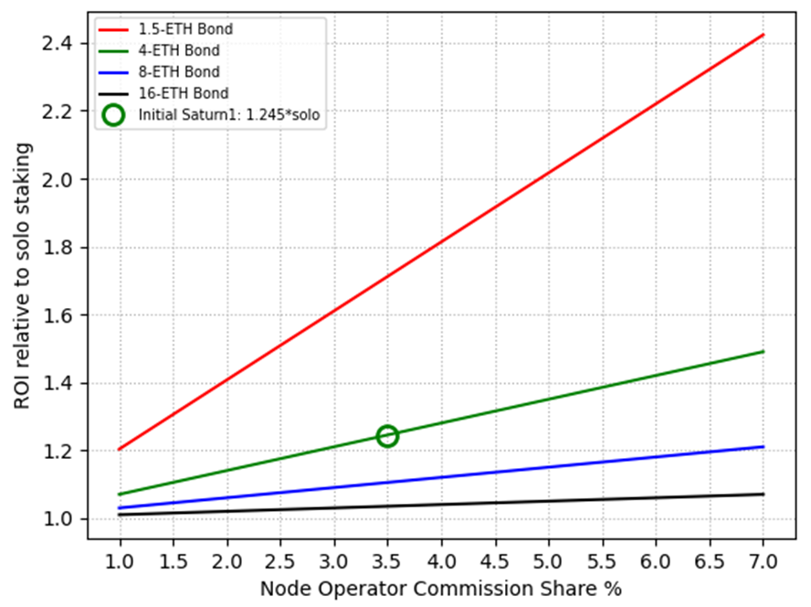




<a href="{{cPrev.url|relative_url}}">Previous - {{cPrev.title}}</a>Previous
<a href="{{cNext.url|relative_url}}">Next - {{cNext.title}}</a>Next

## Choose your depth

- Intro: [Why Rework Rocket Pool's Tokenomics?](./001-why-rework.md)
- Intro: [Introduction to the Tokenomics Rework](./002-rework-intro.md)
- Core: [Foundation of the Tokenomics Rework](./003-rework-foundation.md)
- Intermediate: [Supporting components of the Tokenomics Rework](./004-rework-support.md)
- Advanced: [RPIP-49](../RPIPs/RPIP-49.md) tokenomics spec overview and linked RPIPs

## Protocol Revenue
For this section we'll make two simplifications throughout:

1: To minimize text/diagram complexity, we assume "RPL buy+burn" as the value capture method for the surplus share. Please see [RPL Value Captur eOptions](#rpl-value-capture-options) for alternatives and a discussion of their impacts.

2: While the proposal actually has 4-ETH bonds (and later a mix of 4-ETH and 1.5-ETH bonds), we use 8-ETH bonds in this section to get an apples-to-apples comparison against current 8-ETH minipools.

### Overview
There is only one source of revenue for the protocol, the fee charged to rETH holders. In the current system, this is 14%, paid to Node Operators (NOs), who are required to bring a bond of both ETH and RPL. The proposed rework changes things by creating 3 categories of rewards to distribute this revenue:
- **NOs (ETH) - "Node Operator Commission Share"**. This is paid to all Node Operators in a similar manner as existing validators. One difference is that your eligibility to receive from this share _depends only on your ETH, not on your RPL_ (where previously the Node Operator commission required an initial minimum requirement of both ETH and RPL). This change allows ETH Only NOs.
- **NOs (RPL) - "Voter Share"**. This share is collected from all validators, and then distributed to participants based on their proportional share of vote-eligible RPL. If you stake RPL as a Node Operator, your RPL is eligible for voting, so you would receive a proportional share from this pot of revenue. Importantly this revenue grows with rETH TVL, where growth would allow the same supply of vote eligible RPL to earn more ETH. 
- **All RPL - "Surplus Share"**. This share is collected from all validators, and then used to buy back RPL tokens and burn them. This revenue also grows with rETH TVL, where growth would allow the same supply of total RPL to earn more ETH. 

Importantly, the same participant may be eligible to benefit from all 3 categories. As an example take the Node Operator in existing tokenomics, represented in Figure 1's pie chart in blue. You can see how an equivalent participant shows up in blue in the new tokenomics in Figure 2. Their ETH earns from the 3.5% Node Operator Commission Share, their staked RPL earns from the Voter Share and also benefits from the Surplus Share. The Surplus Share includes gold dots to represent a new beneficiary of protocol revenue for some of this slice (unstaked RPL).

 
_Figure 1 - Current tokenomics pie_
 
_Figure 2 - Proposed tokenomics pie_

One key difference is the removal of the minimum RPL stake requirement. Previously, this was the primary source of value capture for RPL, and RPL inflation rewards were used as an incentive for NOs to maintain at least the same level of RPL exposure that was initially required. With the proposed rework, RPL inflation to NOs is no longer required since NOs are free to choose any level of RPL exposure they are comfortable with, and RPL value capture instead comes directly from protocol revenue. By no loger rewarding NOs with RPL (which is currently generated via inflation) the rate of inflation of the RPL token is also reduced which further supports its long-term value.

Previously, Rocket Pool targeted a very narrow window of participants to support the protocol by forcing multiple requirements of the same individual: (1) technical expertise to perform Node Operator duties, (2) the minimum ETH requirement, (3) the minimum RPL requirement, and (4) ideally a particular ratio of ETH to RPL to maximize validators for a given amount of capital. In reality, there may be demand for more limited forms of participation from individuals who may not meet all three requirements. By structuring the incentives to support that demand, there is greater opportunity to grow the pie of total protocol revenue, which would benefit all participants in the protocol. Some examples include:
- The market can now be opened to ETH Only Node Operators
- Node Operators can choose the degree of RPL exposure they feel comfortable with (no more cliff)
- RPL holders benefit directly from protocol revenue and a reduced rate of inflation

### Node Operator Perspective
Let’s examine things from a Node Operator perspective, starting with existing tokenomics. In the diagrams below, blue will represent ETH and orange will represent RPL (with value still shown in ETH).

For this sub-section we make three simplifying assumptions. First, a solo staking APY of 4.17% was chosen to help get round numbers – this means each validator generates 1 ETH per year on the 24 borrowed ETH (for context, currently observed solo APY is ~3.8%). Second, where RPL exists, the RPL/ETH market cap is assumed to stay flat. Finally, we assume all users are using the same type of pool. 

**Current minimum LEB8 allocation**
 
_Figure 3 - Current LEB8 Sankey Diagram_

The NO earns solo staking APY on their bond (0.334 ETH), 14% commission on the borrowed ETH (0.14 ETH), and RPL rewards (0.14 ETH)[^1]. Meanwhile, they lose RPL value to inflation going to NOs for RPL rewards (0.084 ETH) and inflation going to DAO expenses (0.036 ETH). 

The end result is that the Node Operator would make **1.14x solo staking APY right now**. At maturity, RPL would approach ~100% staked, at which point RPL rewards and Inflation to NOs cancel each other out resulting in **1.01x solo staking APY**. Back to the current state, if a Node Operator loses eligibility for RPL rewards (which often happens due to falling RPL/ETH price ratio), the loss of the 0.14ETH in RPL rewards would result in **0.82x solo staking APY**.

**Proposal using ETH-only allocation**
 
_Figure 4 - Proposal ETH-only Sankey Diagram_

The NO earns solo staking APY on their bond (0.334 ETH), and 3.5% commission on the borrowed ETH (0.035 ETH).

The end result is that the Node Operator would make **1.11x solo staking APY right now**.

**Proposal using current minimum LEB8 allocation**
 
_Figure 5 - Proposal w/minimum LEB8 Allocation Sankey Diagram_

The NO earns solo staking APY on their bond (0.334 ETH), 3.5% commission on the borrowed ETH (0.035 ETH), 5% revenue share on their vote-eligible RPL (0.05 ETH)[^2], and 5.5% revenue share on their RPL (0.033 ETH)[^3]. Meanwhile, they lose RPL value to inflation going to DAO expenses (0.036 ETH). 

The end result is that the Node Operator would make **0.96x solo staking APY right now**. Note that voter share depends on your exposure to RPL relative to other NOs. Eg, if half of the validators are ETH-only and half look like this NO, then voter share reward to this NO would double to 0.1 ETH; that would result in **1.07x solo staking APY**. This dynamic will be explored further in the Case Study below.

#### Case Study: ETH-only is Preferred by Node Operators

**Proposal Example, Reference**
 
_Figure 6 - Case Study Reference Sankey Diagram_

In this case study, we have 3 NOs. (A) has 8 ETH and no RPL staked. (B) has 8 ETH and 6 ETH worth of RPL staked. (C) has 8 ETH and 15 ETH worth of RPL staked (note that vote-eligible RPL is capped at 150% of bonded ETH).

**Proposal Example, 9 more ETH-Only Node Operators join**
 
_Figure 7 - Case Study ETH-only Growth Sankey Diagram_

Now we see 9 more NOs identical to (A) join. As you can see, there’s a self-balancing effect. Voter Share value paid to NO B and C increased 4x even though they have the same RPL.	Surplus Share value increased 4x over the same supply of RPL. In short: Node Operators unwilling to take on RPL exposure still grow the protocol’s ability to meet rETH demand, and higher rETH TVL makes RPL exposure more attractive.

## Lower Bonds and Capital Efficiency
Zooming _all_ the way out, the total revenue is `reth_commision*reth_tvl_in_validators`. To get total ROI, we divide that by total investment, which is `(bonded_eth + rpl_mcap_in_eth)`. From this we can see that there are 4 ways for total ROI to improve if all else is held equal: (1) increased rETH commission, (2) increased rETH TVL, (3) less bonded ETH, and (4) lower RPL market cap. Lower bonds are important because they are the only way to execute on (3) without decreasing rETH TVL. In fact, lower bonds also help hit (2) by making it possible to service more rETH TVL given the same NO investment.

### ETH-only Validator ROIs (Saturn 1)
Zooming in to a single operator, the easiest way to look at the impact of lower bonds is by considering ETH-only validators and looking at their ROI. As we can see - we get dramatically higher ROIs for the same commission (or, equivalently, can get the same ROI with dramatically lower commission). The takeaway is simple from a capital efficiency point of view – smaller bonds are better.

 
_Figure 8 - ROI based on NO commission share and ETH bond per validator_

### Proposed Bond Curve’s ROI (Saturn 2)
Despite the "smaller is better" takeaway from above, there are real limits. Security requires us to have enough bond per validator to align incentives and mitigate damage in cases of slashing, abandonment, and MEV theft. The result is a proposal that starts out with 4 ETH per validator for the first 2 validators; thereafter, the bond is 1.5 ETH per validator. We can see that ROI improves rapidly as a node operator adds validators, and then starts to flatten out. Note that this proposal requires forced exits to be available for security, which is why it cannot be implemented until Saturn 2.

 
_Figure 9 -  ROI based on NO commission share and total bonded ETH_

Keep in mind that if this is extremely attractive, [UARS](#uars-and-listening-to-the-market) allows us to improve the balance by reducing node_operator_commission_share and increasing another share. Similarly, if it’s not attractive enough, node_operator_commission_share can be increased at the cost of decreasing another share. Do note that there’s quite a significant impact to ROI with a small change in share – eg, at 64 ETH bonded, we see a 0.5% change in share causes a ~6% change in ROI.

## UARS and Listening to the Market

### Current State

**Fixed Commission:**
Currently, Rocket Pool has an individual validator fixed commission model. This means each validator will always charge the same commission for the lifetime of that validator (or until the Node Operator opts into an upgrade that changes the commission). With the existing system, 100% of the rETH commission goes to Node Operator commission, so the protocol’s average rETH commission only changes slowly, as new validators are added or Node Operators opt to upgrade their validators to a new commission.

**Fixed Protocol Fee:**
The RPL staking minimum serves as an indirect protocol fee. Since it’s fixed at 10% of borrowed ETH, it represents a fixed fee. The protocol’s average fee is resistant to change, even if we did vote a change in. The impact of such a change would only be realized slowly, as new validators are added, or Node Operators withdraw RPL (which may require exiting and recreating validators in some cases).

### Proposal
**UARS (Universal Adjustable Revenue Split):**
One major change in the proposal is that the Revenue Split variables will apply _universally_ across all megapools, and they will be _adjustable_ by the protocol without requiring a validator exit and migration to new validators with a different fixed setting. Universal settings can allow changes that benefit the protocol and the participants in the protocol without perverse incentives (eg, in the Current State, there can be a tragedy of the commons situation where each individual Node Operator would avoid opting into a lower commission, even though they’d all prefer it if _everyone_ opted that way).

**Choosing Revenue Split Sizes:**
Ultimately the pDAO (Node Operators with staked RPL) controls the Revenue Split variables and has the ability to change them through voting. 

Some abstract guidelines the pDAO should consider when deciding the sizes of the Revenue Splits:
- Consider **Node Operator Commission Share** as a requirement to function. If this share is not high enough to attract the supply we need, the protocol is non-functional
- Consider **Voter Share** as a requirement to function. If there is not enough vote-eligible staked RPL, then the protocol can become at risk for governance attacks. There is a method specified that balances Voter Share vs Surplus Share to ensure ~60% of all RPL is vote eligible.
-  Finally, consider **Surplus Share**. RPL holders are incentivized to maximize something along the lines of `surplus_share * rETH_TVL`. This means voters generally have an incentive to balance a high surplus_share with making rETH holding attractive.

With these factors in mind, the pDAO should pay attention to the market, and take actions as necessary to ensure healthy sustainable settings.

**Listening to the Market:**
There are natural checks and balances that allow "non-voting" participants to create market pressures. Some examples:
- If Node Operators don’t find holding RPL attractive, they may still opt to run ETH-only. This grows total revenue and makes holding RPL more attractive. See [Case Study: ETH-only is Preferred by Node Operators](#case-study-eth-only-is-preferred-by-node-operators).
- If rETH holders find rETH unattractive, they can sell (or not buy) rETH. This limit to growth also limits the value of RPL.
- If ETH-Only Node Operators don’t find the commission attractive enough, they can choose a competitor who provides them with higher compensation for their services.
- If RPL holders don’t find the value capture attractive enough, they can sell (or not buy) RPL; this will decrease the ETH value of RPL, which improves the ROI in ETH terms. 

## RPL Value Capture Options
This section describes three potential implementations for how the "Surplus Share" described in [Protocol Revenue](#protocol-revenue) can be used to drive value to RPL.

The current plan is to vote on the full proposal before deciding which "Surplus Share" implementation to use. This lets the dev team start work, and gives the community more time to form consensus after further modeling/research.

Ideally, the preferred implementation can still make it into Saturn 1. If not, it will be in Saturn 2; in such a case, the revenue during the Saturn 1 period will be allowed to build up and then get distributed over a bit of time once Saturn 2 is live.

### Buy + Burn
For buy + burn, ETH revenue is used to buy RPL on the open market. The RPL is then burnt to permanently remove it from the total supply of RPL. In theory, the market cap of RPL should be unchanged by this, while the supply is reduced, which would mean the price per RPL token increases (by its share of the ETH revenue). The implementation uses a time-averaged market price and avoids large steps in available burn liquidity to limit opportunities for someone to game the system and steal value. 

### Buy + LP
For buy + LP, ETH revenue is used for single sided deposits into an RPL/rETH Liquidity Pool (note that a single sided deposit is equivalent to an RPL buy followed by an asset-weighted deposit).

The liquidity pool is a weighted pool with 90% RPL weight and 10% rETH weight. This means that ~90% of revenue would go to driving value to RPL directly, while 10% would go to building deep protocol-owned-liquidity for RPL. The other two options do not build liquidity – this means the pDAO would need to fund that liquidity some other way (or not have much).

Unlike Buy + Burn, no time averaging on price is possible since the liquidity pool is a live market. As a result, the implementation will take even more care to avoid large steps.

### Voter Share
For voter share there is no “Surplus Share”, and instead this ETH revenue is directed to “Voter Share”, which goes to vote-eligible RPL. This means only NOs are natively able to benefit from RPL’s value capture directly. This has some positives (direct ETH received instead of indirect value captured; avoids some complexity in implementing one of the above options) and some negatives (much smaller total addressable market). Note that it may become possible for non-NOs to benefit via abstractions (eg, Nodeset’s proposed xRPL).

<a href="{{cPrev.url|relative_url}}">Previous - {{cPrev.title}}</a>Previous
<a href="{{cNext.url|relative_url}}">Next - {{cNext.title}}</a>Next

---

[^1]: RPL rewards are modeled by calculating RPL yield as: `RPL APY = [% RPL inflation to NOs] / [% of staked RPL supply] = 3.5%/60% = 5.83%
5.83% * 2.4ETH = 0.14ETH`
[^2]: The example shown assumes this Node Operator represents the average staked RPL exposure of all NOs, so they earn average Voter Share rewards of 5%
[^3]: The example shown assumes this Node Operator represents the average amount of staked RPL out of all staked RPL holders and that 60% of RPL is staked. Based on that, this Node Operator would earn `60% * 5.5% = 3.3%, or 0.033 ETH`
