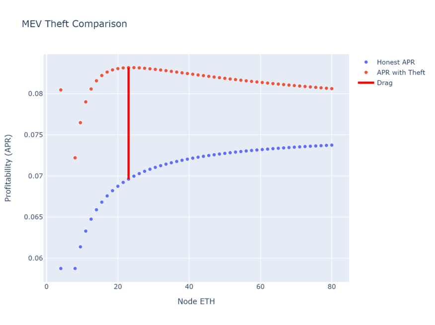




<a href="{{cPrev.url|relative_url}}">Previous - {{cPrev.title}}</a>Previous
<a href="{{cNext.url|relative_url}}">Next - {{cNext.title}}</a>Next

## Choose your depth

- Intro: [Why Rework Rocket Pool's Tokenomics?](./001-why-rework.md)
- Intro: [Introduction to the Tokenomics Rework](./002-rework-intro.md)
- Core: [Foundation of the Tokenomics Rework](./003-rework-foundation.md)
- Intermediate: [Supporting components of the Tokenomics Rework](./004-rework-support.md)
- Advanced: [RPIP-49](../RPIPs/RPIP-49.md) tokenomics spec overview and linked RPIPs

## Anti-sock Puppet Effects
Rocket Pool currently has modest incentives to sock puppet. Due to the square root scaling, sock puppeting increases voting power. It also allows additional flexibility in RPL staking (eg, you could have some undercollateralized pools on one node and a separate collateralized node receiving RPL rewards).

As shown in [Lower Bonds and Capital Efficiency](./003-rework-foundation.md#lower-bonds-and-capital-efficiency), the bond curves make profitability increase as you have more validators on one node. This will give people a strong reason to avoid sock puppeting behavior. Note also, that getting rid of the cliff also removes one possible reason to engage in sock puppeting.

## Megapools
Currently Rocket Pool minipools each have their own Ethereum contract. This results in high gas costs for NOs with several minipools (gas-intensive to launch or distribute rewards for several validators). The Saturn upgrade introduces megapools, where a single megapool contract is used as an Ethereum withdrawal address for multiple validators. This drastically reduces gas costs for launching or distributing rewards for several validators (by almost N times, where N is the number of validators the NO is running).

## Forced Exits
Currently, if a minipool is penalized, the protocol has no way to forcibly reclaim that bond. It can set a penalty, which will be enforced on the exit of the underlying validator. This means a rogue NO could continue running their minipool profitably indefinitely after that point in time.

Saturn 2 includes forced exits, which allow the protocol to initialize the exit of a validator when certain conditions are met. This would allow the protocol to immediately reclaim a highly penalized bond, and prevent hypothetical rogue NOs from being a drag on the protocol.

## Node Level Penalties
Currently, penalties can be applied on a per minipool basis. Consider an NO with 4 LEB8 minipools that steals 30 ETH of MEV in one block. At this time, only that minipool will be penalized, and any other minipools that NO has will be unaffected. This means that Rocket Pool could recover at most the 8 ETH bond from the LEB8 minipool that stole the block. With node level penalties, the bond from all of the minipools could be recovered. Note that while node level penalties could be implemented for minipools, it’s even easier to implement for megapools.

Putting together the bond curve, forced exits, and node level penalties:
An example comparing Honest APY vs. APY with MEV-theft is shown in Figure 1 below. You can see how the first validator (only a 4 ETH bond) has the significantly highest amount of drag for the protocol, but if a thief was wanting to maximize their APY, they would create 12 validators. At 12 validators the drag for the protocol is significantly reduced (vs at a single validator), and the protocol is much safer since it would have the ability to recover 23ETH of NO bond from the entire megapool, instead of just 4 ETH of NO bond from a single validator.

 
_Figure 1 - Profitability with and without MEV theft_

## Forced Upgrades
Saturn 1 includes the ability to force NOs to upgrade the delegate contracts used to manage their validators. This serves as a way to (a) limit long-term technical debt accrual and (b) rely on upcoming functionality (notably validator forced exits). In order to give NOs plenty of freedom to choose how they operate, there is a multi-month grace period before the delegate must be upgraded.

## Express Queue
With the Saturn Upgrade, existing NOs who want to migrate will need to exit their legacy validators and create new validators under a megapool contract. This churn, along with the potential for NO supply to outpace rETH demand (due to things like the introduction of ETH-Only validators) could lead to a significant NO queue. To support decentralization, protocol safety, and the health of the Ethereum network the Saturn Upgrade also introduces an express queue. To enter the express queue you must use an express queue ticket, and tickets are distributed to favor both small NOs and existing NOs. To favor small NOs, two[^1] express queue tickets will be given to all NOs (including new NOs). Express queue tickets will also be given to all existing NOs (_enough tickets to allow for express migration of all bonded ETH to 4-ETH bond validators[^1]). The express queue works as a parallel queue that moves twice* as fast as the standard NO queue. ETH from the deposit pool is matched with validator deposits by taking alternating turns matching from the express queue and the standard queue. On each express queue turn two[^1] validator matches will be made, but on each standard queue turn only one validator match is made (this is what causes the express queue to move twice[^1] as fast). If a queue is empty, those matches will be skipped.

<a href="{{cPrev.url|relative_url}}">Previous - {{cPrev.title}}</a>Previous
<a href="{{cNext.url|relative_url}}">Next - {{cNext.title}}</a>Next

---

[^1]: *initial specifications are listed for simplicity, but these values could be changed if necessary
