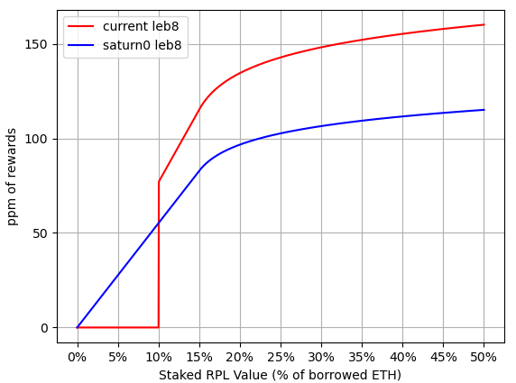




<a href="{{cPrev.url|relative_url}}">Previous - {{cPrev.title}}</a>Previous
<a href="{{cNext.url|relative_url}}">Next - {{cNext.title}}</a>Next

## Context and Motivation
With the DAO having voted for the Saturn upgrade, the fundamental value of RPL will primarily be based on protocol TVL instead of a bonding mechanism as it had been. As a prelude to that, Saturn 0 focuses on making node operation more attractive by allowing minipool creation without RPL and removing the cliff for RPL issuance rewards. Saturn 0 avoids smart contract changes[^1] to allow implementation in a matter of weeks (much sooner than waiting until Saturn 1).

## Contents

### RPL Issuance Rewards:
Saturn 0 will remove the cliff for RPL issuance rewards. This means RPL issuance rewards will be adjusted such that Node Operators earn the maximum APY for staked RPL positions worth 0-15% of borrowed ETH.

 
_Figure 1 - RPL Issuance Rewards Structure_

### ETH Commission Structure
Newly-launched Saturn 0 minipools will receive a commission ranging from 10% to 14%. This consists of 5% from the minipool contract and a dynamic commission boost ranging from 5% (no RPL staked) to 9% (staked RPL valued at ≥10% of borrowed ETH). Dynamic commission uses the smoothing pool for distribution, so opting into the smoothing pool is strongly recommended for Saturn 0 minipools.

For reference, ETH returns are:
- **1.30x** solo staking APY for ETH-only minipools[^3]
- Up to **1.42x** solo staking APY when staking RPL[^4]

 
_Figure 2 - ETH Commission Structure_

### Transitioning to Saturn 1
As previously mentioned, the goal of Saturn 0 is to capture TVL. More precisely, the goal is to capture TVL in megapools (since megapools contribute to protocol-wide revenue sharing).
This is addressed three ways:
1. Node operators will want to migrate to megapools to get higher yield. For example, an LEB4 at 5% commission yields **1.35x** solo staking APY. This is made possible by Saturn 1+’s lower bond per validator (and thus greater capital efficiency). Things are further improved by the lower operational costs due to a single megapool contract.
2. On the 5th reward snapshot after Saturn 1 is released, dynamic commission is reduced to 0%, resulting in **1.15x** solo staking APY from contract commission only. This serves to increase the yield advantage of migrating.
3. Finally, if a node operator still does not migrate, there is no real issue for the protocol. With dynamic commission set to 0%, the remaining minipools serve to boost rETH APY by reducing its effective commission (similarly to boosting the `reth_share` component in Saturn 1+).

<a href="{{cPrev.url|relative_url}}">Previous - {{cPrev.title}}</a>Previous
<a href="{{cNext.url|relative_url}}">Next - {{cNext.title}}</a>Next

---

[^1]: See [RPIP-62](https://rpips.rocketpool.net/RPIPs/RPIP-62) and [RPIP-63](https://rpips.rocketpool.net/RPIPs/RPIP-63) for further information
[^2]: Note that the dynamic commission boost is temporary, and will be removed on the 5th reward period snapshot after Saturn 1 is released (see [Transitioning to Saturn 1](#transitioning-to-saturn-1))
[^3]: ROI is calculated using the following formula `(bonded_eth + commission_pct * borrowed_eth) / bonded_eth`, which equates to `(8 + 10% * 24) / 8 = 1.3`
[^4]: The same formula is used as before. Note that the equation only accounts for the cost/rewards of ETH, and ignores the cost/rewards of RPL
